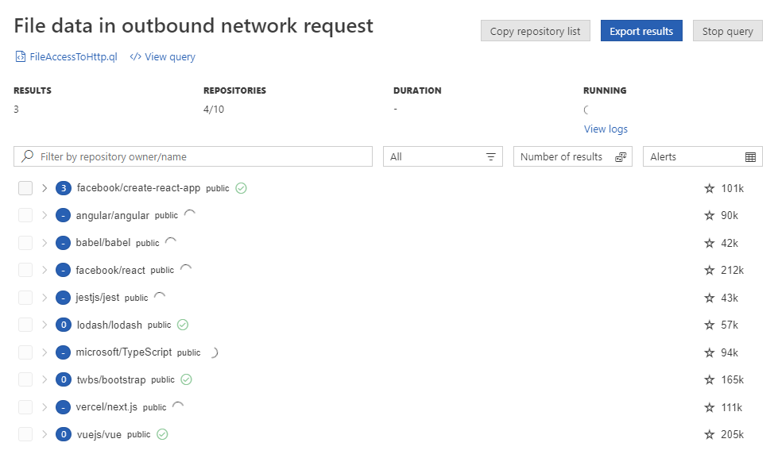
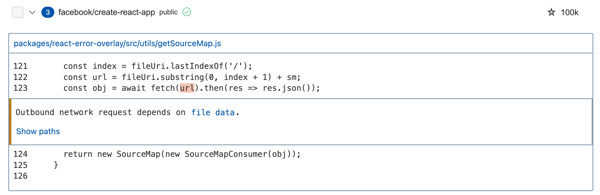

:tocdepth: 1

.. _running-codeql-queries-at-scale-with-mrva:

Running CodeQL queries at scale with multi-repository variant analysis
======================================================================

.. include:: ../reusables/vs-code-deprecation-note.rst

.. include:: ../reusables/beta-note-mrva.rst

About multi-repository variant analysis
---------------------------------------

When you write a query to find variants of a security vulnerability and finish testing it locally, the next step is to run it on a large group of repositories. Multi-repository variant analysis (variant analysis) makes it easy run a query on up to 1000 repositories without leaving Visual Studio Code.

The core functionality of the CodeQL extension helps you write queries and run them locally against a CodeQL database. In contrast, variant analysis allows you to send your CodeQL query to GitHub.com to be tested against a list of repositories.

When you run variant analysis against a list of repositories, your query is run against each repository that has a CodeQL database available to analyze. GitHub creates and stores the latest CodeQL database for the default branch of thousands of public repositories, including every repository that runs code scanning using CodeQL. 

If you want to run variant analysis on your repositories, you need to enable code scanning using CodeQL on GitHub.com before adding your repository to a list for analysis (either default setup, or advanced setup using the CodeQL action). For information about enabling code scanning using CodeQL, see "`Configuring code scanning automatically <https://docs.github.com/en/code-security/code-scanning/automatically-scanning-your-code-for-vulnerabilities-and-errors/configuring-code-scanning-for-a-repository#configuring-code-scanning-automatically>`__."

.. _controller-repository:

Setting a controller repository for variant analysis
----------------------------------------------------

When you run variant analysis, the analysis is run entirely using GitHub Actions. You don't need to create any workflows, but you must specify which GitHub repository the CodeQL extension should use as the "controller repository." Controller repositories can be empty, but they must have at least one commit. 

.. pull-quote::
   
   Note

   - The controller repository visibility can be "public" if you plan to analyze public repositories. The variant analysis will be free.
   - The controller repository visibility must be "private" if you need to analyze any private or internal repositories. Any actions minutes used by variant analysis, above the free limit, will be charged to the repository owner. For more information about free minutes and billing, see "`About billing for GitHub Actions <https://docs.github.com/en/billing/managing-billing-for-github-actions/about-billing-for-github-actions>`__." 

You must define a controller repository before you can run your first variant analysis.

.. image:: ../images/codeql-for-visual-studio-code/controller-repository.png
    :width: 350
    :alt: Screenshot of the CodeQL extension in Visual Studio Code. The "Variant Analysis Repositories" section is expanded and the "Set up controller repository" button is highlighted with a dark orange outline.

#. In Visual Studio Code, click **QL** in the left sidebar to display the CodeQL extension.

#. Expand **Variant Analysis Repositories** and click **Set up controller repository** to display a field for the controller repository.

#. Type the owner and name of the repository on GitHub.com that you want to use as your controller repository and press the **Enter** key.

#. If you are prompted to authenticate with GitHub, follow the instructions and sign into your personal or organization account. When you have finished following the process, a prompt from GitHub Authentication may ask for permission to open a URI in Visual Studio Code, click **Open**.

The name of the controller repository is saved in your settings for the CodeQL extension. For information on how to edit the controller repository, see ":ref:`Customizing settings <customizing-settings>`."

Running a query at scale using variant analysis
-----------------------------------------------

#. Expand the **Variant Analysis Repositories** section, to show the default lists which include a selection of 10, 100, and 1,000 public repositories on GitHub.com for the language that you are analyzing.

#. Select which GitHub repository or repositories you want to run your query against. Click a row to highlight it, and then click **Select** to select that repository, organization, or list of repositories. If you want to add a new repository, organization, or list, use the options in the header panel. For information, see ":ref:`Creating custom lists of repositories <custom-lists>`", later in this article.

    .. image:: ../images/codeql-for-visual-studio-code/variant-analysis-repo-lists.png
        :width: 350
        :alt: Screenshot of the CodeQL extension in Visual Studio Code. The "Variant Analysis Repositories" section is expanded. The "Top 10 repositories" item has a checkmark to show that it is currently selected for analysis. The user has clicked on the row for a single repository "octo-org/octo-repo" and it is highlighted blue. The "Select" button for that row is highlighted with a dark orange highlight.

#. Open the query you want to run, right-click in the query file, and select **CodeQL: Run Variant Analysis** to start variant analysis.

The CodeQL extension builds a CodeQL pack with your library and any library dependencies. The CodeQL pack and your selected repository list are posted to an API endpoint on GitHub.com which triggers a GitHub Actions dynamic workflow in your controller repository. The workflow spins up multiple parallel jobs to execute the CodeQL query against the repositories in the list, optimizing query execution. As each repository is analyzed, the results are processed and displayed in a Variant Analysis Results view in Visual Studio Code.

.. pull-quote::

    Note

    If you need to cancel the variant analysis run for any reason, click **Stop query** in the Variant Analysis Results view.

Exploring your results
----------------------

When you run variant analysis, as soon as a workflow to run your analysis on GitHub is running, a Variant Analysis Results view opens to display the results as they are ready. You can use this view to monitor progress, see any errors, and access the workflow logs in your controller repository.

When your variant analysis run is scheduled, the results view automatically opens. Initially the view shows a list of every repository that was scheduled for analysis. As each repository is analyzed, the view is updated to show a summary of the number of results. To view the detailed results for a repository (including results paths), click the repository name.

For each repository, you can see:

- Number of results found by the query
- Visibility of the repository
- Whether analysis is still running (black, moving circle) or finished (green checkmark)
- Number of stars the repository has on GitHub

To see the results for a repository:

y.

#. Click the repository name to show a summary of each result.

#. Explore the information available for each result using links to the source files in GitHub.com and, for data flow queries, the **Show paths** link. For more information, see ":ref:`Exploring data flow with path queries <exploring-data-flow-with-path-queries>`."

Exporting your results
----------------------

You can export your results for further analysis or to discuss them with collaborators. In the results view, click **Export results** to export the results to a secret gist on GitHub.com or to a markdown file in your workspace.

.. _custom-lists:

Creating custom lists of repositories
-------------------------------------

After you have defined a controller repository, the Variant Analysis Repositories panel shows the lists of repositories that you can select for variant analysis. You can use the options in the panel header to add a specific repository or organization to the panel, and to create and manage custom lists of repositories for variant analysis.

.. pull-quote::

    Note

    CodeQL analysis always requires a CodeQL database to run queries against. When you run variant analysis against a list of repositories, your query will only be executed against the repositories that currently have a CodeQL database available to download.  The best way to make a repository available for variant analysis is to enable code scanning with CodeQL. For information about enabling code scanning using CodeQL, see "`Configuring code scanning automatically <https://docs.github.com/en/code-security/code-scanning/automatically-scanning-your-code-for-vulnerabilities-and-errors/configuring-code-scanning-for-a-repository#configuring-code-scanning-automatically>`__."

Selecting a single GitHub repository or organization for analysis
~~~~~~~~~~~~~~~~~~~~~~~~~~~~~~~~~~~~~~~~~~~~~~~~~~~~~~~~~~~~~~~~~

#. In the Variant Analysis Repositories panel, click the **+**, add new database, icon. 

#. From the dropdown menu, click **From a GitHub repository** or **All repositories of GitHub org or owner**.

#. Type the identifier of the repository or organization that you want to use into the field.

    .. image:: ../images/codeql-for-visual-studio-code/variant-analysis-repo-and-org.png
        :width: 350
        :alt: Screenshot of the CodeQL extension in Visual Studio Code. The "Variant Analysis Repositories" section is expanded to show a repository (octo-org/octo-repo) and an organization (octo-org). These items are highlighted with a dark orange outline.

Creating a custom list of repositories
~~~~~~~~~~~~~~~~~~~~~~~~~~~~~~~~~~~~~~

#. In the Variant Analysis Repositories panel, click the |add-list| icon.

#. Type a name for the new list and press **Enter**.

#. Select your list in the panel and then click **+**, to add a repository to your list.

You can manage and edit your custom lists by right-clicking on either the list name, or a repository name within the list, and selecting an option from the context menu.

The custom lists are stored in your workspace in a ``databases.json`` file. If you want to edit this file directly, you can open it by clicking **{ }** in the panel header. 

For example, if you want to continue analyzing a set of repositories that had results for your query, click **Copy repository list** in the Variant Analysis Results view to add a list of only the repositories that have results to the clipboard as JSON. For example:

.. code-block:: json

    {
        "name": "new-repo-list",
        "repositories": [
            "facebook/create-react-app"
        ]
    }

You can then insert the ``new-repo-list`` of repositories into your list of custom repository lists for easy access in the Variant Analysis Repositories panel.

Using GitHub code search to add repositories to a custom list 
~~~~~~~~~~~~~~~~~~~~~~~~~~~~~~~~~~~~~~~~~~~~~~~~~~~~~~~~~~~~~

You can use code search directly in the CodeQL extension to add a subset of repositories from GitHub.com to a custom list. 

.. pull-quote::

    Note

    This feature uses the legacy code search via the code search API. For more information on the syntax to use, see "`Searching code (legacy) <https://docs.github.com/en/search-github/searching-on-github/searching-code>`__."

For example, to add all repositories in the ``rails`` organization on GitHub, you can search ``org:rails``. 

You can add a maximum of 1000 repositories to a custom list per search. 

#. In the Variant Analysis Repositories panel, choose the list that you want to add repositories to. You can create a new list or choose an existing list that already contains repositories.

#. Right-click on the list you have chosen and then click **Add repositories with GitHub Code Search**. 

#. In the pop-up that appears at the top of the application, under the search bar, select a language for your search from the choices in the dropdown. 

    .. image:: ../images/codeql-for-visual-studio-code/variant-analysis-code-search-language.png
        :alt: Screenshot of the search bar for using code search to add repositories to a custom list. The search bar asks you to choose a language for your search and has a dropdown list of languages to choose from.

#. In the search bar, type the search query that you want to use and press **Enter**.

You can view the progress of your search in the bottom right corner of the application in a box with the text "Searching for repositories...". If you click **Cancel**, no repositories will be added to your list. Once complete, you will see the resulting repositories appear in the dropdown under your custom list in the Variant Analysis Repositories panel.

Some of the resulting repositories will not have CodeQL databases and some may not allow access by the CodeQL extension for Visual Studio Code. When you run an analysis on the list, the Variant Analysis Results view will show you which repositories were analyzed, which denied access, and which had no CodeQL database.

Troubleshooting variant analysis
--------------------------------

For information on troubleshooting variant analysis, see
":ref:`Troubleshooting variant analysis <troubleshooting-variant-analysis>`."

