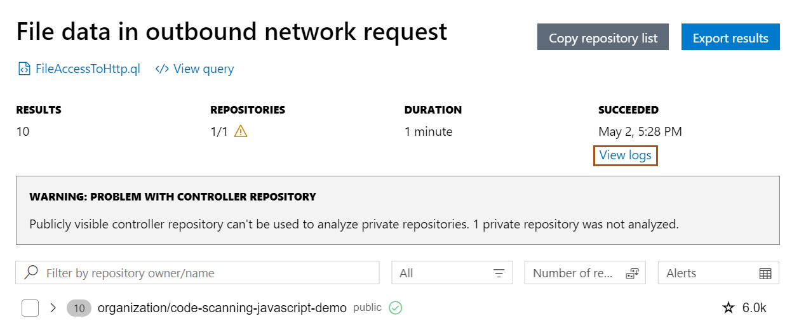

:tocdepth: 1

.. _troubleshooting-variant-analysis:

Troubleshooting variant analysis
================================

.. include:: ../reusables/beta-note-mrva.rst

This article explains how to debug problems with variant analysis. That is, analysis run using GitHub Actions
and not locally on your machine.
For information on troubleshooting local analysis, see
":ref:`Troubleshooting CodeQL for Visual Studio Code <troubleshooting-codeql-for-visual-studio-code>`."

When you run variant analysis, there are two key places where errors and warnings are displayed:

#. **Visual Studio Code errors** - any problems with creating a CodeQL pack and sending the analysis to GitHub.com are reported as Visual Studio Code errors in the bottom right corner of the application. The problem information is also available in the **Problems** view.
#. **Variant Analysis Results** - any problems with the variant analysis run are reported in this view.

Variant analysis warning: Problem with controller repository
------------------------------------------------------------

If there are problems with the variant analysis run, you will see a warning banner at the top of the Variant Analysis Results tab. For example:

In this example, the user ran variant analysis on a custom list of two repositories. One of the repositories was a private repository and could not be analyzed because they had a public controller repository. Only the public repository was analyzed. To analyze both repositories, they need to edit their settings and update the controller repository to a private repository. For information on how to edit the controller repository, see ":ref:`Customizing settings <customizing-settings>`."

CodeQL extension error: Bundling pack failed
--------------------------------------------

If the CodeQL extension fails to create the CodeQL pack, you will see an error message in the bottom right corner of Visual Studio Code. For example:

TODO: Ask James to check this is a reasonable example, or to create a better screenshot for this example.

The most likely cause of this type of error is that your current workspace does not contain the CodeQL workspace.

You can update your environment to fix this problem as follows.

#. Change the root of your workspace for Visual Studio Code to be the same as your CodeQL workspace.

TODO: Ask for more information about this step above.

#. Add an extra folder in your workspace (**File > Add Folder to Workspace**) for the suite-helpers: ``codeql/misc/suite-helpers``.

#. Using the terminal in Visual Studio Code, use the CodeQL CLI to download the ``codeql/suite-helpers`` pack: ``codeql pack download codeql/suite-helpers``.

