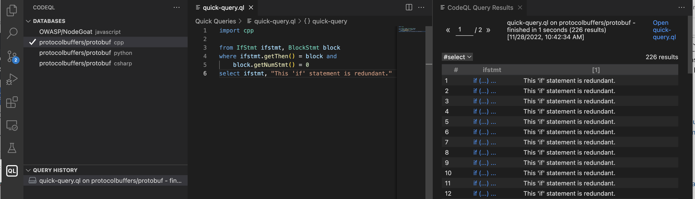
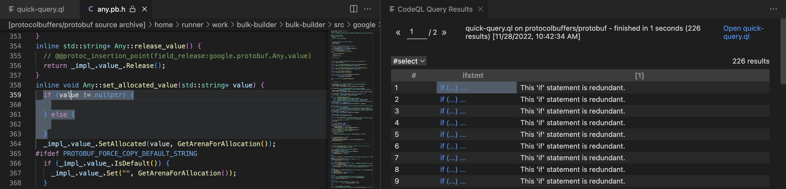

.. _basic-query-for-cpp-code:

Basic query for C and C++ code
==============================

Learn to write and run a simple CodeQL query using Visual Studio Code with the CodeQL extension.

.. include:: ../reusables/setup-to-run-queries.rst

About the query
---------------

The query we're going to run performs a basic search of the code for ``if`` statements that are redundant, in the sense that they have an empty then branch. For example, code such as:

.. code-block:: cpp

   if (error) { }

Finding a CodeQL database to experiment with
--------------------------------------------

Before you start writing queries, you need a CodeQL database to run them against. The simplest way to do this is to download a database directly from GitHub.com.

#. In Visual Studio Code, click the **QL** icon |codeql-ext-icon| in the left sidebar to display the CodeQL extension. 

#. Click **From GitHub** or the GitHub logo |github-db| at the top of the CodeQL extension to open an entry field.

#. Copy the URL for the repository into the field and press the keyboard **Enter** key.

#. Optionally, if the repository has more than one CodeQL database available, choose which language to download.

Information about the progress of the database download is shown in the bottom right corner of Visual Studio Code. When the download is complete, the database is shown with a check mark in the **Databases** section of the CodeQL extension.

Running the query
-----------------

#. In Visual Studio Code, create a new folder to store your experimental queries for C and C++ CodeQL databases. For example, ``cpp-experiments``.

#. Create a ``qlpack.yml`` file in your experiments folder with the contents shown below. This tells the CodeQL extension that any queries you create in the folder are intended to run on C or C++ CodeQL databases.

   .. code-block:: yaml

      name: github-owner/cpp-experiments
      version: 0.0.1
      dependencies:
         codeql/cpp-all: ^0.1.2

#. Create a second new file in your experiements folder with the ``.ql`` file extension. You will write your first query in this file.

#. Copy the following query into the new file and save the file:

   .. code-block:: ql

      import cpp

      from IfStmt ifstmt, BlockStmt block
      where ifstmt.getThen() = block and
        block.getNumStmt() = 0
      select ifstmt, "This 'if' statement is redundant."

#. Right-click in the query window and select **CodeQL: Run Query**. (Alternatively, run the command from the Command Palette.)

   The query will take a few moments to return results. When the query completes, the results are displayed in a CodeQL Query Results window, alongside the query window.
   
   The query results are listed in two columns, corresponding to the two expressions in the ``select`` clause of the query. The first column corresponds to the expression ``ifstmt`` and is linked to the location in the source code of the project where ``ifstmt`` occurs. The second column is the alert message.

If any matching code is found, click a link in the ``ifstmt`` column to open the file and highlight the matching ``if`` statement.

About the query structure
~~~~~~~~~~~~~~~~~~~~~~~~~

After the initial ``import`` statement, this simple query comprises three parts that serve similar purposes to the FROM, WHERE, and SELECT parts of an SQL query.

+---------------------------------------------------------------+-------------------------------------------------------------------------------------------------------------------+------------------------------------------------------------------------------------------------------------------------+
| Query part                                                    | Purpose                                                                                                           | Details                                                                                                                |
+===============================================================+===================================================================================================================+========================================================================================================================+
| ``import cpp``                                                | Imports the standard CodeQL libraries for C/C++.                                                                  | Every query begins with one or more ``import`` statements.                                                             |
+---------------------------------------------------------------+-------------------------------------------------------------------------------------------------------------------+------------------------------------------------------------------------------------------------------------------------+
| ``from IfStmt ifstmt, BlockStmt block``                       | Defines the variables for the query.                                                                              | We use:                                                                                                                |
|                                                               | Declarations are of the form:                                                                                     |                                                                                                                        |
|                                                               | ``<type> <variable name>``                                                                                        | - an ``IfStmt`` variable for ``if`` statements                                                                         |
|                                                               |                                                                                                                   | - a ``BlockStmt`` variable for the statement block                                                                     |
+---------------------------------------------------------------+-------------------------------------------------------------------------------------------------------------------+------------------------------------------------------------------------------------------------------------------------+
| ``where ifstmt.getThen() = block and block.getNumStmt() = 0`` | Defines a condition on the variables.                                                                             | ``ifstmt.getThen() = block`` relates the two variables. The block must be the ``then`` branch of the ``if`` statement. |
|                                                               |                                                                                                                   |                                                                                                                        |
|                                                               |                                                                                                                   | ``block.getNumStmt() = 0`` states that the block must be empty (that is, it contains no statements).                   |
+---------------------------------------------------------------+-------------------------------------------------------------------------------------------------------------------+------------------------------------------------------------------------------------------------------------------------+
| ``select ifstmt, "This 'if' statement is redundant."``        | Defines what to report for each match.                                                                            | Reports the resulting ``if`` statement with a string that explains the problem.                                        |
|                                                               |                                                                                                                   |                                                                                                                        |
|                                                               | ``select`` statements for queries that are used to find instances of poor coding practice are always in the form: |                                                                                                                        |
|                                                               | ``select <program element>, "<alert message>"``                                                                   |                                                                                                                        |
+---------------------------------------------------------------+-------------------------------------------------------------------------------------------------------------------+------------------------------------------------------------------------------------------------------------------------+

Extend the query
----------------

Query writing is an inherently iterative process. You write a simple query and then, when you run it, you discover examples that you had not previously considered, or opportunities for improvement.

Remove false positive results
~~~~~~~~~~~~~~~~~~~~~~~~~~~~~

Browsing the results of our basic query shows that it could be improved. Among the results you are likely to find examples of ``if`` statements with an ``else`` branch, where an empty ``then`` branch does serve a purpose. For example:

.. code-block:: cpp

   if (...) {
     ...
   } else if (!strcmp(option, "-verbose")) {
     // nothing to do - handled earlier
   } else {
     error("unrecognized option");
   }

In this case, identifying the ``if`` statement with the empty ``then`` branch as redundant is a false positive. One solution to this is to modify the query to ignore empty ``then`` branches if the ``if`` statement has an ``else`` branch.

To exclude ``if`` statements that have an ``else`` branch:

#. Edit your query and extend the ``where`` clause to include the following extra condition:

   .. code-block:: ql

      and not ifstmt.hasElse()

   The ``where`` clause is now:

   .. code-block:: ql

      where ifstmt.getThen() = block and
        block.getNumStmt() = 0 and
        not ifstmt.hasElse()

#. Re-run the query.

   There are now fewer results because ``if`` statements with an ``else`` branch are no longer reported.

Further reading
---------------

.. include:: ../reusables/cpp-further-reading.rst
.. include:: ../reusables/codeql-ref-tools-further-reading.rst

