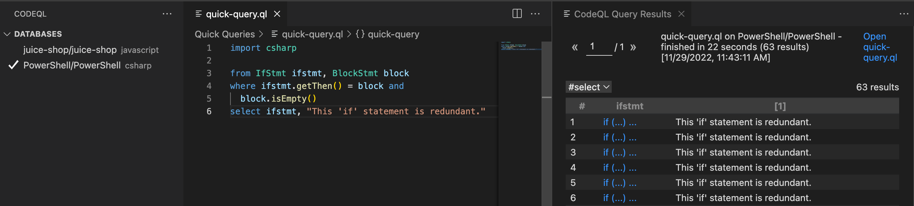
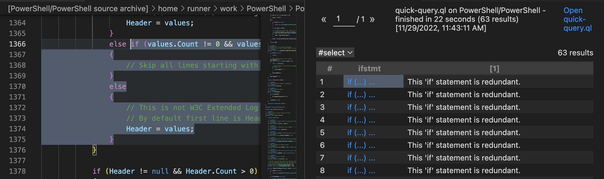
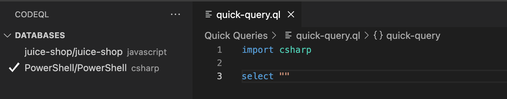

.. _basic-query-for-csharp-code:

Basic query for C# code
=======================

Learn to write and run a simple CodeQL query using Visual Studio Code with the CodeQL extension.

.. include:: ../reusables/vs-code-basic-instructions/setup-to-run-queries.rst

About the query
---------------

The query we're going to run performs a basic search of the code for ``if`` statements that are redundant, in the sense that they have an empty then branch. For example, code such as:

.. code-block:: csharp

   if (error) { }

.. include:: ../reusables/vs-code-basic-instructions/find-database.rst

Running a quick query
---------------------

.. include:: ../reusables/vs-code-basic-instructions/run-quick-query-1.rst

#. In the quick query tab, delete ``select ""`` and paste the following query beneath the import statement ``import csharp``.

   .. code-block:: ql

      from IfStmt ifstmt, BlockStmt block
      where ifstmt.getThen() = block and
        block.isEmpty()
      select ifstmt, "This 'if' statement is redundant."  

 .. include:: ../reusables/vs-code-basic-instructions/run-quick-query-2.rst

If any matching code is found, click a link in the ``ifstmt`` column to open the file and highlight the matching ``if`` statement.

.. include:: ../reusables/vs-code-basic-instructions/note-store-quick-query.rst

About the query structure
~~~~~~~~~~~~~~~~~~~~~~~~~

After the initial ``import`` statement, this simple query comprises three parts that serve similar purposes to the FROM, WHERE, and SELECT parts of an SQL query.

+---------------------------------------------------------------+-------------------------------------------------------------------------------------------------------------------+------------------------------------------------------------------------------------------------------------------------+
| Query part                                                    | Purpose                                                                                                           | Details                                                                                                                |
+===============================================================+===================================================================================================================+========================================================================================================================+
| ``import csharp``                                             | Imports the standard CodeQL libraries for C#.                                                                     | Every query begins with one or more ``import`` statements.                                                             |
+---------------------------------------------------------------+-------------------------------------------------------------------------------------------------------------------+------------------------------------------------------------------------------------------------------------------------+
| ``from IfStmt ifstmt, BlockStmt block``                       | Defines the variables for the query.                                                                              | We use:                                                                                                                |
|                                                               | Declarations are of the form:                                                                                     |                                                                                                                        |
|                                                               | ``<type> <variable name>``                                                                                        | - an ``IfStmt`` variable for ``if`` statements                                                                         |
|                                                               |                                                                                                                   | - a ``BlockStmt`` variable for the then block                                                                          |
+---------------------------------------------------------------+-------------------------------------------------------------------------------------------------------------------+------------------------------------------------------------------------------------------------------------------------+
| ``where ifstmt.getThen() = block and block.isEmpty()``        | Defines a condition on the variables.                                                                             | ``ifstmt.getThen() = block`` relates the two variables. The block must be the ``then`` branch of the ``if`` statement. |
|                                                               |                                                                                                                   |                                                                                                                        |
|                                                               |                                                                                                                   | ``block.isEmpty()`` states that the block must be empty (that is, it contains no statements).                          |
+---------------------------------------------------------------+-------------------------------------------------------------------------------------------------------------------+------------------------------------------------------------------------------------------------------------------------+
| ``select ifstmt, "This 'if' statement is redundant."``        | Defines what to report for each match.                                                                            | Reports the resulting ``if`` statement with a string that explains the problem.                                        |
|                                                               |                                                                                                                   |                                                                                                                        |
|                                                               | ``select`` statements for queries that are used to find instances of poor coding practice are always in the form: |                                                                                                                        |
|                                                               | ``select <program element>, "<alert message>"``                                                                   |                                                                                                                        |
+---------------------------------------------------------------+-------------------------------------------------------------------------------------------------------------------+------------------------------------------------------------------------------------------------------------------------+

Extend the query
----------------

Query writing is an inherently iterative process. You write a simple query and then, when you run it, you discover examples that you had not previously considered, or opportunities for improvement.

Remove false positive results
~~~~~~~~~~~~~~~~~~~~~~~~~~~~~

Browsing the results of our basic query shows that it could be improved. Among the results you are likely to find examples of ``if`` statements with an ``else`` branch, where an empty ``then`` branch does serve a purpose. For example:

.. code-block:: csharp

   if (...)
   {
       ...
   }
   else if (option == "-verbose")
   {
       // nothing to do - handled earlier
   }
   else
   {
       error("unrecognized option");
   }

In this case, identifying the ``if`` statement with the empty ``then`` branch as redundant is a false positive. One solution to this is to modify the query to ignore empty ``then`` branches if the ``if`` statement has an ``else`` branch.

To exclude ``if`` statements that have an ``else`` branch:

#. Add the following to the where clause:

   .. code-block:: ql

      and not exists(ifstmt.getElse())

   The ``where`` clause is now:

   .. code-block:: ql

      where ifstmt.getThen() = block and
        block.isEmpty() and
        not exists(ifstmt.getElse())

#. Re-run the query.

   There are now fewer results because ``if`` statements with an ``else`` branch are no longer included.

Further reading
---------------

.. include:: ../reusables/csharp-further-reading.rst
.. include:: ../reusables/codeql-ref-tools-further-reading.rst

.. Article-specific substitutions for the reusables used in docs/codeql/reusables/vs-code-basic-instructions
.. |language-text| replace:: C#

.. |language-code| replace:: ``csharp``

.. |example-url| replace:: https://github.com/PowerShell/PowerShell

.. |result-col-1|  replace:: The first column corresponds to the expression ``ifstmt`` and is linked to the location in the source code of the project where ``ifstmt`` occurs.
