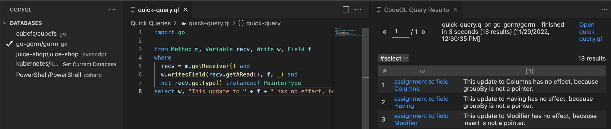
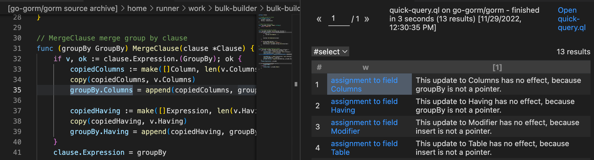
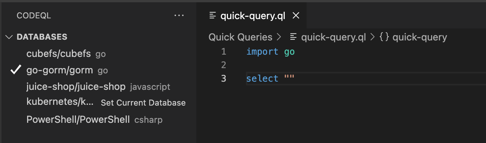

.. _basic-query-for-go-code:

Basic query for Go code
=======================

Learn to write and run a simple CodeQL query using Visual Studio Code with the CodeQL extension.

.. include:: ../reusables/vs-code-basic-instructions/setup-to-run-queries.rst

About the query
---------------

The query we're going to run searches the code for methods defined on value types that modify their receiver by writing a field:

.. code-block:: go

   func (s MyStruct) valueMethod() { s.f = 1 } // method on value

This is problematic because the receiver argument is passed by value, not by reference. Consequently, valueMethod is called with a copy of the receiver object, so any changes it makes to the receiver will be invisible to the caller. To prevent this, the method should be defined on a pointer instead:

.. code-block:: go

   func (s *MyStruct) pointerMethod() { s.f = 1 } // method on pointer

For further information on using methods on values or pointers in Go, see the `Go FAQ <https://golang.org/doc/faq#methods_on_values_or_pointers>`__.

.. include:: ../reusables/vs-code-basic-instructions/find-database.rst

Running a quick query
---------------------

.. include:: ../reusables/vs-code-basic-instructions/run-quick-query-1.rst

#. In the quick query tab, delete ``select ""`` and paste the following query beneath the import statement ``import go``.

   .. code-block:: ql

      from Method m, Variable recv, Write w, Field f
      where
        recv = m.getReceiver() and
        w.writesField(recv.getARead(), f, _) and
        not recv.getType() instanceof PointerType
      select w, "This update to " + f + " has no effect, because " + recv + " is not a pointer."

.. include:: ../reusables/vs-code-basic-instructions/run-quick-query-2.rst

If any matching code is found, click a link in the ``w`` column to open the file and highlight the matching location.

.. include:: ../reusables/vs-code-basic-instructions/note-store-quick-query.rst

About the query structure
~~~~~~~~~~~~~~~~~~~~~~~~~

After the initial ``import`` statement, this simple query comprises three parts that serve similar purposes to the FROM, WHERE, and SELECT parts of an SQL query.

+---------------------------------------------------------------+-------------------------------------------------------------------------------------------------------------------+--------------------------------------------------------------------------------------------------------------------------------------+
| Query part                                                    | Purpose                                                                                                           | Details                                                                                                                              |
+===============================================================+===================================================================================================================+======================================================================================================================================+
| ``import go``                                                 | Imports the standard CodeQL libraries for Go.                                                                     | Every query begins with one or more ``import`` statements.                                                                           |
+---------------------------------------------------------------+-------------------------------------------------------------------------------------------------------------------+--------------------------------------------------------------------------------------------------------------------------------------+
| ``from Method m, Variable recv, Write w, Field f``            | Defines the variables for the query.                                                                              | We declare:                                                                                                                          |
|                                                               | Declarations are of the form:                                                                                     |                                                                                                                                      |
|                                                               | ``<type> <variable name>``                                                                                        | - ``m`` as a variable for all methods                                                                                                |
|                                                               |                                                                                                                   | - a ``recv`` variable, which is the receiver of ``m``                                                                                |
|                                                               |                                                                                                                   | - ``w`` as the location in the code where the receiver is modified                                                                   |
|                                                               |                                                                                                                   | - ``f`` as the field that is written when ``m`` is called                                                                            |
+---------------------------------------------------------------+-------------------------------------------------------------------------------------------------------------------+--------------------------------------------------------------------------------------------------------------------------------------+
| ``where recv = m.getReceiver() and                            | Defines a condition on the variables.                                                                             | ``recv = m.getReceiver()`` states that ``recv`` must be the receiver variable of ``m``.                                              |
| w.writesField(recv.getARead(), f, _) and                      |                                                                                                                   |                                                                                                                                      |
| not recv.getType() instanceof PointerType``                   |                                                                                                                   | ``w.writesField(recv.getARead(), f, _)`` states that ``w`` must be a location in the code where field ``f`` of ``recv`` is modified. |
|                                                               |                                                                                                                   | We use a :ref:`'don't-care' expression <don-t-care-expressions>` ``_``                                                               |
|                                                               |                                                                                                                   | for the value that is written to ``f``—the actual value doesn't matter in this query.                                                |
|                                                               |                                                                                                                   |                                                                                                                                      |
|                                                               |                                                                                                                   | ``not recv.getType() instanceof PointerType`` states that ``m`` is not a pointer method.                                             |
+---------------------------------------------------------------+-------------------------------------------------------------------------------------------------------------------+--------------------------------------------------------------------------------------------------------------------------------------+
| ``select w, "This update to " + f +                           | Defines what to report for each match.                                                                            | Reports ``w`` with a message that explains the potential problem.                                                                    |
| " has no effect, because " + recv + " is not a pointer."``    |                                                                                                                   |                                                                                                                                      |
|                                                               | ``select`` statements for queries that are used to find instances of poor coding practice are always in the form: |                                                                                                                                      |
|                                                               | ``select <program element>, "<alert message>"``                                                                   |                                                                                                                                      |
+---------------------------------------------------------------+-------------------------------------------------------------------------------------------------------------------+--------------------------------------------------------------------------------------------------------------------------------------+

Extend the query
----------------

Query writing is an inherently iterative process. You write a simple query and then, when you run it, you discover examples that you had not previously considered, or opportunities for improvement.

Remove false positive results
~~~~~~~~~~~~~~~~~~~~~~~~~~~~~

Among the results generated by the first iteration of this query, you can find cases where a value method is called but the receiver variable is returned. In such cases, the change to the receiver is not invisible to the caller, so a pointer method is not required. These are false positive results and you can improve the query by adding an extra condition to remove them.

To exclude these values:

#. Extend the where clause to include the following extra condition:

   .. code-block:: ql

      not exists(ReturnStmt ret | ret.getExpr() = recv.getARead().asExpr())

   The ``where`` clause is now:

   .. code-block:: ql

      where e.isPure() and
        recv = m.getReceiver() and
        w.writesField(recv.getARead(), f, _) and
        not recv.getType() instanceof PointerType and
        not exists(ReturnStmt ret | ret.getExpr() = recv.getARead().asExpr())

#. Re-run the query.

   There are now fewer results because value methods that return their receiver variable are no longer reported.

Further reading
---------------

.. include:: ../reusables/go-further-reading.rst
.. include:: ../reusables/codeql-ref-tools-further-reading.rst

.. Article-specific substitutions for the reusables used in docs/codeql/reusables/vs-code-basic-instructions

.. |language-text| replace:: Go

.. |language-code| replace:: ``go``

.. |example-url| replace:: https://github.com/go-gorm/gorm

.. |result-col-1| replace:: The first column corresponds to ``w``, which is the location in the source code where the receiver ``recv`` is modified.
