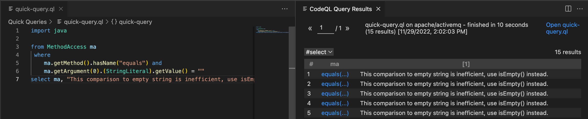

.. _basic-query-for-java-code:

Basic query for Java and Kotlin code
====================================

Learn to write and run a simple CodeQL query using Visual Studio Code with the CodeQL extension.

.. include:: ../reusables/vs-code-basic-instructions/setup-to-run-queries.rst

About the query
---------------

The query we're going to run searches for inefficient tests for empty strings. For example, Java code such as:

.. code-block:: java

    public class TestJava {
        void myJavaFun(String s) {
            boolean b = s.equals("");
        }
    }

or Kotlin code such as:

.. code-block:: kotlin

    void myKotlinFun(s: String) {
        var b = s.equals("")
    }

In either case, replacing ``s.equals("")`` with ``s.isEmpty()``
would be more efficient.

.. include:: ../reusables/vs-code-basic-instructions/find-database.rst

Running a quick query
---------------------

.. include:: ../reusables/vs-code-basic-instructions/run-quick-query-1.rst

#. In the quick query tab, delete ``select ""`` and paste the following query beneath the import statement ``import java``.

   .. code-block:: ql

        from MethodAccess ma
        where
            ma.getMethod().hasName("equals") and
            ma.getArgument(0).(StringLiteral).getValue() = ""
        select ma, "This comparison to empty string is inefficient, use isEmpty() instead."

   Note that CodeQL treats Java and Kotlin as part of the same language, so even though this query starts with ``import java``, it will work for both Java and Kotlin code.

 .. include:: ../reusables/vs-code-basic-instructions/run-quick-query-2.rst

If any matching code is found, click a link in the ``ma`` column to view the ``.equals`` expression in the code viewer.

.. include:: ../reusables/vs-code-basic-instructions/note-store-quick-query.rst

About the query structure
~~~~~~~~~~~~~~~~~~~~~~~~~

After the initial ``import`` statement, this simple query comprises three parts that serve similar purposes to the FROM, WHERE, and SELECT parts of an SQL query.

+--------------------------------------------------------------------------------------------------+-------------------------------------------------------------------------------------------------------------------+---------------------------------------------------------------------------------------------------+
| Query part                                                                                       | Purpose                                                                                                           | Details                                                                                           |
+==================================================================================================+===================================================================================================================+===================================================================================================+
| ``import java``                                                                                  | Imports the standard CodeQL libraries for Java and Kotlin.                                                        | Every query begins with one or more ``import`` statements.                                        |
+--------------------------------------------------------------------------------------------------+-------------------------------------------------------------------------------------------------------------------+---------------------------------------------------------------------------------------------------+
| ``from MethodAccess ma``                                                                         | Defines the variables for the query.                                                                              | We use:                                                                                           |
|                                                                                                  | Declarations are of the form:                                                                                     |                                                                                                   |
|                                                                                                  | ``<type> <variable name>``                                                                                        | - a ``MethodAccess`` variable for call expressions                                                |
+--------------------------------------------------------------------------------------------------+-------------------------------------------------------------------------------------------------------------------+---------------------------------------------------------------------------------------------------+
| ``where ma.getMethod().hasName("equals") and ma.getArgument(0).(StringLiteral).getValue() = ""`` | Defines a condition on the variables.                                                                             | ``ma.getMethod().hasName("equals")`` restricts ``ma`` to only calls to methods call ``equals``.   |
|                                                                                                  |                                                                                                                   |                                                                                                   |
|                                                                                                  |                                                                                                                   | ``ma.getArgument(0).(StringLiteral).getValue() = ""`` says the argument must be literal ``""``.   |
+--------------------------------------------------------------------------------------------------+-------------------------------------------------------------------------------------------------------------------+---------------------------------------------------------------------------------------------------+
| ``select ma, "This comparison to empty string is inefficient, use isEmpty() instead."``          | Defines what to report for each match.                                                                            | Reports the resulting ``.equals`` expression with a string that explains the problem.             |
|                                                                                                  |                                                                                                                   |                                                                                                   |
|                                                                                                  | ``select`` statements for queries that are used to find instances of poor coding practice are always in the form: |                                                                                                   |
|                                                                                                  | ``select <program element>, "<alert message>"``                                                                   |                                                                                                   |
+--------------------------------------------------------------------------------------------------+-------------------------------------------------------------------------------------------------------------------+---------------------------------------------------------------------------------------------------+

Extend the query
----------------

Query writing is an inherently iterative process. You write a simple query and then, when you run it, you discover examples that you had not previously considered, or opportunities for improvement.

Remove false positive results
~~~~~~~~~~~~~~~~~~~~~~~~~~~~~

Browsing the results of our basic query shows that it could be improved. For example, you may find results for code like:

.. code-block:: java

    public class TestJava {
        void myJavaFun(Object o) {
            boolean b = o.equals("");
        }
    }

In this case, it is not possible to simply use ``o.isEmpty()`` instead, as ``o`` has type ``Object`` rather than ``String``. One solution to this is to modify the query to only return results where the expression being tested has type ``String``:

#. Extend the where clause to include the following extra condition:

   .. code-block:: ql

    ma.getQualifier().getType() instanceof TypeString

   The ``where`` clause is now:

   .. code-block:: ql

      where
        ma.getQualifier().getType() instanceof TypeString and
        ma.getMethod().hasName("equals") and
        ma.getArgument(0).(StringLiteral).getValue() = ""

#. Re-run the query.

   There are now fewer results because ``.equals`` expressions with different types are no longer included.

Further reading
---------------

.. include:: ../reusables/java-further-reading.rst
.. include:: ../reusables/codeql-ref-tools-further-reading.rst

.. Article-specific substitutions for the reusables used in docs/codeql/reusables/vs-code-basic-instructions

.. |language-text| replace:: Java/Kotlin

.. |language-code| replace:: ``java``

.. |example-url| replace:: https://github.com/apache/activemq

.. |result-col-1|  replace:: The first column corresponds to the expression ``ma`` and is linked to the location in the source code of the project where ``ma`` occurs.