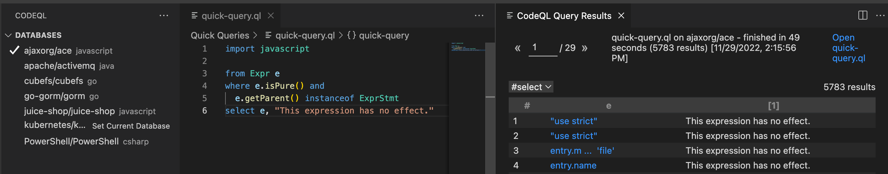
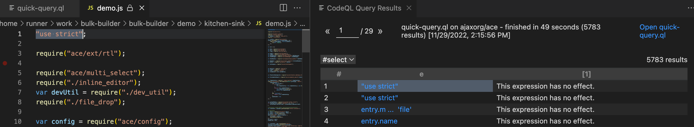
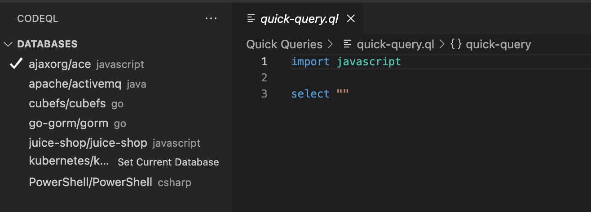

.. _basic-query-for-javascript-code:

Basic query for JavaScript and TypeScript code
===============================================

Learn to write and run a simple CodeQL query using Visual Studio Code with the CodeQL extension.

.. include:: ../reusables/vs-code-basic-instructions/setup-to-run-queries.rst

About the query
---------------

In JavaScript and TypeScript, any expression can be turned into an expression statement. While this is sometimes convenient, it can be dangerous. For example, imagine a programmer wants to assign a new value to a variable ``x`` by means of an assignment ``x = 42``. However, they accidentally type two equals signs, producing the comparison statement ``x == 42``. This is valid JavaScript, so no error is generated. The statement simply compares ``x`` to ``42``, and then discards the result of the comparison.

The query you will run finds instances of this problem. The query searches for expressions ``e`` that are pure—that is, their evaluation does not lead to any side effects—but appear as an expression statement.

.. include:: ../reusables/vs-code-basic-instructions/find-database.rst

Running a quick query
---------------------

.. include:: ../reusables/vs-code-basic-instructions/run-quick-query-1.rst

#. In the quick query tab, delete ``select ""`` and paste the following query beneath the import statement ``import javascript``.

   .. code-block:: ql

      from Expr e
      where e.isPure() and
        e.getParent() instanceof ExprStmt
      select e, "This expression has no effect."

.. include:: ../reusables/vs-code-basic-instructions/run-quick-query-2.rst

If any matching code is found, click one of the links in the ``e`` column to open the file and highlight the matching expression.

.. include:: ../reusables/vs-code-basic-instructions/note-store-quick-query.rst

About the query structure
~~~~~~~~~~~~~~~~~~~~~~~~~

After the initial ``import`` statement, this simple query comprises three parts that serve similar purposes to the FROM, WHERE, and SELECT parts of an SQL query.

+---------------------------------------------------------------+-------------------------------------------------------------------------------------------------------------------+------------------------------------------------------------------------------------------------------------------------+
| Query part                                                    | Purpose                                                                                                           | Details                                                                                                                |
+===============================================================+===================================================================================================================+========================================================================================================================+
| ``import javascript``                                         | Imports the standard CodeQL libraries for JavaScript and TypeScript.                                              | Every query begins with one or more ``import`` statements.                                                             |
+---------------------------------------------------------------+-------------------------------------------------------------------------------------------------------------------+------------------------------------------------------------------------------------------------------------------------+
| ``from Expr e``                                               | Defines the variables for the query.                                                                              | ``e`` is declared as a variable that ranges over expressions.                                                          |
|                                                               | Declarations are of the form:                                                                                     |                                                                                                                        |
|                                                               | ``<type> <variable name>``                                                                                        |                                                                                                                        |
+---------------------------------------------------------------+-------------------------------------------------------------------------------------------------------------------+------------------------------------------------------------------------------------------------------------------------+
| ``where e.isPure() and e.getParent() instanceof ExprStmt``    | Defines a condition on the variables.                                                                             | ``e.isPure()``: The expression is side-effect-free.                                                                    |
|                                                               |                                                                                                                   |                                                                                                                        |
|                                                               |                                                                                                                   | ``e.getParent() instanceof ExprStmt``: The parent of the expression is an expression statement.                        |
+---------------------------------------------------------------+-------------------------------------------------------------------------------------------------------------------+------------------------------------------------------------------------------------------------------------------------+
| ``select e, "This expression has no effect."``                | Defines what to report for each match.                                                                            | Report the expression with a string that explains the problem.                                                         |
|                                                               |                                                                                                                   |                                                                                                                        |
|                                                               | ``select`` statements for queries that are used to find instances of poor coding practice are always in the form: |                                                                                                                        |
|                                                               | ``select <program element>, "<alert message>"``                                                                   |                                                                                                                        |
+---------------------------------------------------------------+-------------------------------------------------------------------------------------------------------------------+------------------------------------------------------------------------------------------------------------------------+

Extend the query
----------------

Query writing is an inherently iterative process. You write a simple query and then, when you run it, you discover examples that you had not previously considered, or opportunities for improvement.

Remove false positive results
~~~~~~~~~~~~~~~~~~~~~~~~~~~~~

Browsing the results of our basic query shows that it could be improved. Among the results you are likely to find ``use strict`` directives. These are interpreted specially by modern browsers with strict mode support and so these expressions *do* have an effect.

To remove directives from the results:

#. Extend the ``where`` clause to include the following extra condition:

   .. code-block:: ql

      and not e.getParent() instanceof Directive

   The ``where`` clause is now:

   .. code-block:: ql

      where e.isPure() and
        e.getParent() instanceof ExprStmt and 
        not e.getParent() instanceof Directive

#. Re-run the query.

   There are now fewer results as ``use strict`` directives are no longer reported.

The improved query finds several results on the example project including the result below:

.. code-block:: javascript

   point.bias == -1;

As written, this statement compares ``point.bias`` against ``-1`` and then discards the result. Most likely, it was instead meant to be an assignment ``point.bias = -1``.

Further reading
---------------

.. include:: ../reusables/javascript-further-reading.rst
.. include:: ../reusables/codeql-ref-tools-further-reading.rst

.. Article-specific substitutions for the reusables used in docs/codeql/reusables/vs-code-basic-instructions

.. |language-text| replace:: JavaScript/TypeScript

.. |language-code| replace:: ``javascript``

.. |example-url| replace:: https://github.com/ajaxorg/ace

.. |result-col-1|  replace:: The first column corresponds to the expression ``e`` and is linked to the location in the source code of the project where ``e`` occurs.