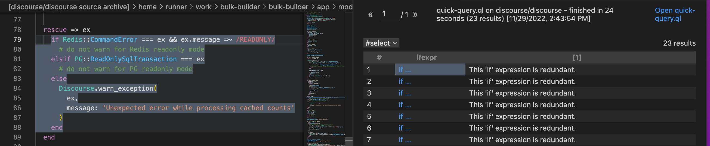

.. _basic-query-for-ruby-code:

Basic query for Ruby code
=========================

Learn to write and run a simple CodeQL query using Visual Studio Code with the CodeQL extension.

.. include:: ../reusables/vs-code-basic-instructions/setup-to-run-queries.rst

About the query
---------------

The query we're going to run performs a basic search of the code for ``if`` expressions that are redundant, in the sense that they have an empty ``then`` branch. For example, code such as:

.. code-block:: ruby

   if error
     # Handle the error

.. include:: ../reusables/vs-code-basic-instructions/find-database.rst

Running a quick query
---------------------

.. include:: ../reusables/vs-code-basic-instructions/run-quick-query-1.rst

#. In the quick query tab, delete the content and paste in the following query.

   .. code-block:: ql

      import codeql.ruby.AST

      from IfExpr ifexpr
      where
      not exists(ifexpr.getThen())
      select ifexpr, "This 'if' expression is redundant."

.. include:: ../reusables/vs-code-basic-instructions/run-quick-query-2.rst

If any matching code is found, click a link in the ``ifexpr`` column to open the file and highlight the matching ``if`` statement.

.. include:: ../reusables/vs-code-basic-instructions/note-store-quick-query.rst

About the query structure
~~~~~~~~~~~~~~~~~~~~~~~~~

After the initial ``import`` statement, this simple query comprises three parts that serve similar purposes to the FROM, WHERE, and SELECT parts of an SQL query.

+---------------------------------------------------------------+-------------------------------------------------------------------------------------------------------------------+------------------------------------------------------------------------------------------------------------------------+
| Query part                                                    | Purpose                                                                                                           | Details                                                                                                                |
+===============================================================+===================================================================================================================+========================================================================================================================+
| ``import codeql.ruby.AST``                                    | Imports the standard CodeQL AST libraries for Ruby.                                                               | Every query begins with one or more ``import`` statements.                                                             |
+---------------------------------------------------------------+-------------------------------------------------------------------------------------------------------------------+------------------------------------------------------------------------------------------------------------------------+
| ``from IfExpr ifexpr``                                        | Defines the variables for the query.                                                                              | We use: an ``IfExpr`` variable for ``if`` expressions.                                                                 |
|                                                               | Declarations are of the form:                                                                                     |                                                                                                                        |
|                                                               | ``<type> <variable name>``                                                                                        |                                                                                                                        |
+---------------------------------------------------------------+-------------------------------------------------------------------------------------------------------------------+------------------------------------------------------------------------------------------------------------------------+
| ``where not exists(ifexpr.getThen())``                        | Defines a condition on the variables.                                                                             | ``ifexpr.getThen()``: gets the ``then`` branch of the ``if`` expression.                                               |
|                                                               |                                                                                                                   |                                                                                                                        |
|                                                               |                                                                                                                   | ``exists(...)``: requires that there is a matching element, in this case a ``then`` branch.                            |
+---------------------------------------------------------------+-------------------------------------------------------------------------------------------------------------------+------------------------------------------------------------------------------------------------------------------------+
| ``select ifexpr, "This 'if' expression is redundant."``       | Defines what to report for each match.                                                                            | Reports the resulting ``if`` expression with a string that explains the problem.                                       |
|                                                               |                                                                                                                   |                                                                                                                        |
|                                                               | ``select`` statements for queries that are used to find instances of poor coding practice are always in the form: |                                                                                                                        |
|                                                               | ``select <program element>, "<alert message>"``                                                                   |                                                                                                                        |
+---------------------------------------------------------------+-------------------------------------------------------------------------------------------------------------------+------------------------------------------------------------------------------------------------------------------------+

Extend the query
----------------

Query writing is an inherently iterative process. You write a simple query and then, when you run it, you discover examples that you had not previously considered, or opportunities for improvement.

Remove false positive results
~~~~~~~~~~~~~~~~~~~~~~~~~~~~~

Browsing the results of our basic query shows that it could be improved. Among the results you are likely to find examples of ``if`` statements with an ``else`` branch, where an empty ``then`` branch does serve a purpose. For example:

.. code-block:: ruby

   if option == "-verbose"
     # nothing to do - handled earlier
   else
     error "unrecognized option"

In this case, identifying the ``if`` statement with the empty ``then`` branch as redundant is a false positive. One solution to this is to modify the query to select ``if`` statements where both the ``then`` and ``else`` branches are missing.

To exclude ``if`` statements that have an ``else`` branch:

#. Add the following to the where clause:

   .. code-block:: ql

      and not exists(ifstmt.getElse())

   The ``where`` clause is now:

   .. code-block:: ql

      where
         not exists(ifexpr.getThen()) and
         not exists(ifexpr.getElse())

#. Re-run the query.

   There are now fewer results because ``if`` expressions with an ``else`` branch are no longer included.

Further reading
---------------

.. include:: ../reusables/ruby-further-reading.rst
.. include:: ../reusables/codeql-ref-tools-further-reading.rst

.. Article-specific substitutions for the reusables used in docs/codeql/reusables/vs-code-basic-instructions

.. |language-text| replace:: Ruby

.. |language-code| replace:: ``ruby``

.. |example-url| replace:: https://github.com/discourse/discourse

.. |image-quick-query| image:: ../images/codeql-for-visual-studio-code/quick-query-tab-ruby.png

.. |result-col-1|  replace:: The first column corresponds to the expression ``ifexpr`` and is linked to the location in the source code of the project where ``ifexpr`` occurs.
