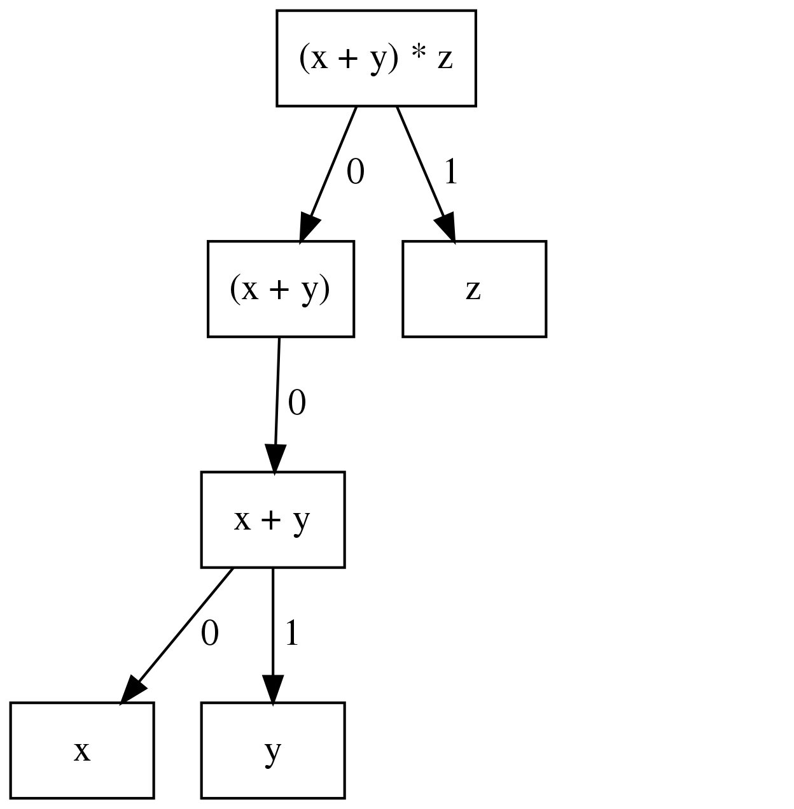
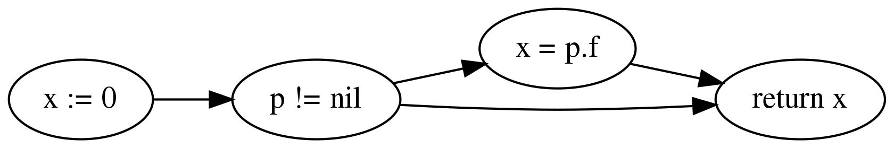
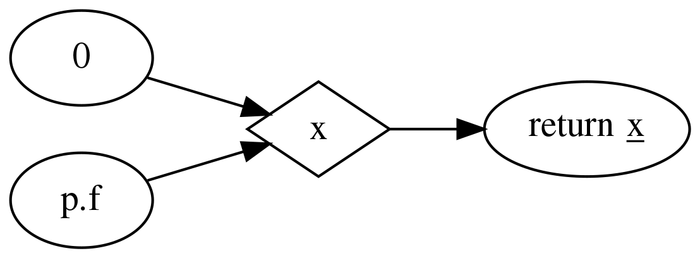
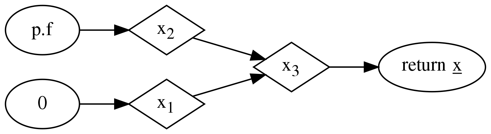

.. _codeql-library-for-go:

CodeQL library for Go
=====================

When you're analyzing a Go program, you can make use of the large collection of classes in the CodeQL library for Go.

Overview
--------

CodeQL ships with an extensive library for analyzing Go code.  The classes in this library present
the data from a CodeQL database in an object-oriented form and provide abstractions and predicates
to help you with common analysis tasks.

The library is implemented as a set of QL modules, that is, files with the extension ``.qll``. The
module ``go.qll`` imports most other standard library modules, so you can include the complete
library by beginning your query with:

.. code-block:: ql

   import go

Broadly speaking, the CodeQL library for Go provides two views of a Go code base: at the `syntactic
level`, source code is represented as an `abstract syntax tree
<https://en.wikipedia.org/wiki/Abstract_syntax_tree>`__ (AST), while at the `data-flow level` it is
represented as a `data-flow graph <https://en.wikipedia.org/wiki/Data-flow_analysis>`__ (DFG). In
between, there is also an intermediate representation of the program as a control-flow graph (CFG),
though this representation is rarely useful on its own and mostly used to construct the higher-level
DFG representation.

The AST representation captures the syntactic structure of the program. You can use it to reason
about syntactic properties such as the nesting of statements within each other, but also about the
types of expressions and which variable a name refers to.

The DFG, on the other hand, provides an approximation of how data flows through variables and
operations at runtime. It is used, for example, by the security queries to model the way
user-controlled input can propagate through the program. Additionally, the DFG contains information
about which function may be invoked by a given call (taking virtual dispatch through interfaces into
account), as well as control-flow information about the order in which different operations may be
executed at runtime.

As a rule of thumb, you normally want to use the AST only for superficial syntactic queries. Any
analysis involving deeper semantic properties of the program should be done on the DFG.

The rest of this tutorial briefly summarizes the most important classes and predicates provided by
this library, including references to the `detailed API documentation
<https://codeql.github.com/codeql-standard-libraries/go/>`__ where applicable. We start by giving an overview of the AST
representation, followed by an explanation of names and entities, which are used to represent
name-binding information, and of types and type information. Then we move on to control flow and the
data-flow graph, and finally the call graph and a few advanced topics.

Abstract syntax
---------------

The AST presents the program as a hierarchical structure of nodes, each of which corresponds to a
syntactic element of the program source text. For example, there is an AST node for each expression
and each statement in the program. These AST nodes are arranged into a parent-child relationship
reflecting the nesting of syntactic elements and the order in which inner elements appear in
enclosing ones.

For example, this is the AST for the expression ``(x + y) * z``:

|ast|

It is composed of six AST nodes, representing ``x``, ``y``, ``x + y``, ``(x + y)``, ``z`` and the
entire expression ``(x + y) * z``, respectively. The AST nodes representing ``x`` and ``y`` are
children of the AST node representing ``x + y``, ``x`` being the zeroth child and ``y`` being the
first child, reflecting their order in the program text. Similarly, ``x + y`` is the only child of
``(x + y)``, which is the zeroth child of ``(x + y) * z``, whose first child is ``z``.

All AST nodes belong to class `AstNode
<https://codeql.github.com/codeql-standard-libraries/go/semmle/go/AST.qll/type.AST$AstNode.html>`__, which defines generic
tree traversal predicates:

-  ``getChild(i)``: returns the ``i``\ th child of this AST node.
-  ``getAChild()``: returns any child of this AST node.
-  ``getParent()``: returns the parent node of this AST node, if any.

These predicates should only be used to perform generic AST traversal. To access children of
specific AST node types, the specialized predicates introduced below should be used instead. In
particular, queries should not rely on the numeric indices of child nodes relative to their parent
nodes: these are considered an implementation detail that may change between versions of the
library.

The predicate ``toString()`` in class ``AstNode`` nodes gives a short description of the AST node,
usually just indicating what kind of node it is. The ``toString()`` predicate does `not` provide
access to the source text corresponding to an AST node. The source text is not stored in the
dataset, and hence is not directly accessible to CodeQL queries.

The predicate ``getLocation()`` in class ``AstNode`` returns a `Location
<https://codeql.github.com/codeql-standard-libraries/go/semmle/go/Locations.qll/type.Locations$Location.html>`__ entity
describing the source location of the program element represented by the AST node. You can use its
member predicates ``getFile()``, ``getStartLine()``, ``getStartColumn``, ``getEndLine()``, and
``getEndColumn()`` to obtain information about its file, start line and column, and end line and
column.

The most important subclasses of `AstNode
<https://codeql.github.com/codeql-standard-libraries/go/semmle/go/AST.qll/type.AST$AstNode.html>`__ are `Stmt
<https://codeql.github.com/codeql-standard-libraries/go/semmle/go/Stmt.qll/type.Stmt$Stmt.html>`__ and `Expr
<https://codeql.github.com/codeql-standard-libraries/go/semmle/go/Expr.qll/type.Expr$Expr.html>`__, which represent
statements and expressions, respectively. This section briefly discusses some of their more
important subclasses and predicates. For a full reference of all the subclasses of `Stmt
<https://codeql.github.com/codeql-standard-libraries/go/semmle/go/Stmt.qll/type.Stmt$Stmt.html>`__ and `Expr
<https://codeql.github.com/codeql-standard-libraries/go/semmle/go/Expr.qll/type.Expr$Expr.html>`__, see
:doc:`Abstract syntax tree classes for Go <abstract-syntax-tree-classes-for-working-with-go-programs>`.

Statements
~~~~~~~~~~

- ``ExprStmt``: an expression statement; use ``getExpr()`` to access the expression itself
- ``Assignment``: an assignment statement; use ``getLhs(i)`` to access the ``i``\ th left-hand side
  and ``getRhs(i)`` to access the ``i``\ th right-hand side; if there is only a single left-hand side
  you can use ``getLhs()`` instead, and similar for the right-hand side

  - ``SimpleAssignStmt``: an assignment statement that does not involve a compound operator

    - ``AssignStmt``: a plain assignment statement of the form ``lhs = rhs``
    - ``DefineStmt``: a short-hand variable declaration of the form ``lhs := rhs``

  - ``CompoundAssignStmt``: an assignment statement with a compound operator, such as ``lhs += rhs``

- ``IncStmt``, ``DecStmt``: an increment statement or a decrement statement, respectively; use
  ``getOperand()`` to access the expression being incremented or decremented
- ``BlockStmt``: a block of statements between curly braces; use ``getStmt(i)`` to access the
  ``i``\ th statement in a block
- ``IfStmt``: an ``if`` statement; use ``getInit()``, ``getCond()``, ``getThen()``, and
  ``getElse()`` to access the (optional) init statement, the condition being checked, the "then"
  branch to evaluate if the condition is true, and the (optional) "else" branch to evaluate
  otherwise, respectively
- ``LoopStmt``: a loop; use ``getBody()`` to access its body

  - ``ForStmt``: a ``for`` statement; use ``getInit()``, ``getCond()``, and ``getPost()`` to access
    the init statement, loop condition, and post statement, respectively, all of which are optional

  - ``RangeStmt``: a ``range`` statement; use ``getDomain()`` to access the iteration domain, and
    ``getKey()`` and ``getValue()`` to access the expressions to which successive keys and values
    are assigned, if any

- ``GoStmt``: a ``go`` statement; use ``getCall()`` to access the call expression that is evaluated
  in the new goroutine
- ``DeferStmt``: a ``defer`` statement; use ``getCall()`` to access the call expression being
  deferred
- ``SendStmt``: a send statement; use ``getChannel()`` and ``getValue()`` to access the channel and
  the value being sent over the channel, respectively
- ``ReturnStmt``: a ``return`` statement; use ``getExpr(i)`` to access the ``i``\ th returned
  expression; if there is only a single returned expression you can use ``getExpr()`` instead
- ``BranchStmt``: a statement that interrupts structured control flow; use ``getLabel()`` to get the
  optional target label

  - ``BreakStmt``: a ``break`` statement
  - ``ContinueStmt``: a ``continue`` statement
  - ``FallthroughStmt``: a ``fallthrough`` statement at the end of a switch case
  - ``GotoStmt``: a ``goto`` statement

- ``DeclStmt``: a declaration statement, use ``getDecl()`` to access the declaration in this
  statement; note that one rarely needs to deal with declaration statements directly, since
  reasoning about the entities they declare is usually easier
- ``SwitchStmt``: a ``switch`` statement; use ``getInit()`` to access the (optional) init statement,
  and ``getCase(i)`` to access the ``i``\ th ``case`` or ``default`` clause

  - ``ExpressionSwitchStmt``: a ``switch`` statement examining the value of an expression
  - ``TypeSwitchStmt``: a ``switch`` statement examining the type of an expression

- ``CaseClause``: a ``case`` or ``default`` clause in a ``switch`` statement; use ``getExpr(i)`` to
  access the ``i``\ th expression, and ``getStmt(i)`` to access the ``i``\ th statement in the body
  of this clause
- ``SelectStmt``: a ``select`` statement; use ``getCommClause(i)`` to access the ``i``\ th ``case``
  or ``default`` clause
- ``CommClause``: a ``case`` or ``default`` clause in a ``select`` statement; use ``getComm()`` to
  access the send/receive statement of this clause (not defined for ``default`` clauses), and
  ``getStmt(i)`` to access the ``i``\ th statement in the body of this clause
- ``RecvStmt``: a receive statement in a ``case`` clause of a ``select`` statement; use
  ``getLhs(i)`` to access the ``i``\ th left-hand side of this statement, and ``getExpr()`` to
  access the underlying receive expression

Expressions
~~~~~~~~~~~

Class ``Expression`` has a predicate ``isConst()`` that holds if the expression is a compile-time
constant. For such constant expressions, ``getNumericValue()`` and ``getStringValue()`` can be used
to determine their numeric value and string value, respectively. Note that these predicates are not
defined for expressions whose value cannot be determined at compile time. Also note that the result
type of ``getNumericValue()`` is the QL type ``float``. If an expression has a numeric value that
cannot be represented as a QL ``float``, this predicate is also not defined. In such cases, you can
use ``getExactValue()`` to obtain a string representation of the value of the constant.

- ``Ident``: an identifier; use ``getName()`` to access its name
- ``SelectorExpr``: a selector of the form ``base.sel``; use ``getBase()`` to access the part before
  the dot, and ``getSelector()`` for the identifier after the dot
- ``BasicLit``: a literal of a basic type; subclasses ``IntLit``, ``FloatLit``, ``ImagLit``,
  ``RuneLit``, and ``StringLit`` represent various specific kinds of literals
- ``FuncLit``: a function literal; use ``getBody()`` to access the body of the function
- ``CompositeLit``: a composite literal; use ``getKey(i)`` and ``getValue(i)`` to access the
  ``i``\ th key and the ``i``\ th value, respectively
- ``ParenExpr``: a parenthesized expression; use ``getExpr()`` to access the expression between the
  parentheses
- ``IndexExpr``: an index expression ``base[idx]``; use ``getBase()`` and ``getIndex()`` to access
  ``base`` and ``idx``, respectively
- ``SliceExpr``: a slice expression ``base[lo:hi:max]``; use ``getBase()``, ``getLow()``,
  ``getHigh()``, and ``getMax()`` to access ``base``, ``lo``, ``hi``, and ``max``, respectively;
  note that ``lo``, ``hi``, and ``max`` can be omitted, in which case the corresponding predicates are not defined
- ``ConversionExpr``: a conversion expression ``T(e)``; use ``getTypeExpr()`` and ``getOperand()``
  to access ``T`` and ``e``, respectively
- ``TypeAssertExpr``: a type assertion ``e.(T)``; use ``getExpr()`` and ``getTypeExpr()`` to access
  ``e`` and ``T``, respectively
- ``CallExpr``: a call expression ``callee(arg0, ..., argn)``; use ``getCalleeExpr()`` to access
  ``callee``, and ``getArg(i)`` to access the ``i``\ th argument
- ``StarExpr``: a star expression, which may be either a pointer-type expression or a
  pointer-dereference expression, depending on context; use ``getBase()`` to access the operand of
  the star
- ``TypeExpr``: an expression that denotes a type
- ``OperatorExpr``: an expression with a unary or binary operator; use ``getOperator()`` to access
  the operator

  - ``UnaryExpr``: an expression with a unary operator; use ``getAnOperand()`` to access the operand
    of the operator
  - ``BinaryExpr``: an expression with a binary operator; use ``getLeftOperand()`` and
    ``getRightOperand()`` to access the left and the right operand, respectively

    - ``ComparisonExpr``: a binary expression that performs a comparison, including both equality
      tests and relational comparisons

      - ``EqualityTestExpr``: an equality test, that is, either ``==`` or ``!=``; the predicate
        ``getPolarity()`` has result ``true`` for the former and ``false`` for the latter
      - ``RelationalComparisonExpr``: a relational comparison; use ``getLesserOperand()`` and
        ``getGreaterOperand()`` to access the lesser and greater operand of the comparison,
        respectively; ``isStrict()`` holds if this is a strict comparison using ``<`` or ``>``,
        as opposed to ``<=`` or ``>=``

Names
~~~~~

While ``Ident`` and ``SelectorExpr`` are very useful classes, they are often too general: ``Ident``
covers all identifiers in a program, including both identifiers appearing in a declaration as well
as references, and does not distinguish between names referring to packages, types, variables,
constants, functions, or statement labels. Similarly, a ``SelectorExpr`` might refer to a package, a
type, a function, or a method.

Class ``Name`` and its subclasses provide a more fine-grained mapping of this space, organized along
the two axes of structure and namespace. In terms of structure, a name can be a ``SimpleName``,
meaning that it is a simple identifier (and hence an ``Ident``), or it can be a ``QualifiedName``,
meaning that it is a qualified identifier (and hence a ``SelectorExpr``). In terms of namespacing, a
``Name`` can be a ``PackageName``, ``TypeName``, ``ValueName``, or ``LabelName``. A ``ValueName``,
in turn, can be either a ``ConstantName``, a ``VariableName``, or a ``FunctionName``, depending on
what sort of entity the name refers to.

A related abstraction is provided by class ``ReferenceExpr``: a reference expression is an
expression that refers to a variable, a constant, a function, a field, or an element of an array or
a slice. Use predicates ``isLvalue()`` and ``isRvalue()`` to determine whether a reference
expression appears in a syntactic context where it is assigned to or read from, respectively.

Finally, ``ValueExpr`` generalizes ``ReferenceExpr`` to include all other kinds of expressions that
can be evaluated to a value (as opposed to expressions that refer to a package, a type, or a
statement label).

Functions
~~~~~~~~~

At the syntactic level, functions appear in two forms: in function declarations (represented by
class ``FuncDecl``) and as function literals (represented by class ``FuncLit``). Since it is often
convenient to reason about functions of either kind, these two classes share a common superclass
``FuncDef``, which defines a few useful member predicates:

  - ``getBody()`` provides access to the function body
  - ``getName()`` gets the function name; it is undefined for function literals, which do not have a
    name
  - ``getParameter(i)`` gets the ``i``\ th parameter of the function
  - ``getResultVar(i)`` gets the ``i``\ th result variable of the function; if there is only
    one result, ``getResultVar()`` can be used to access it
  - ``getACall()`` gets a data-flow node (see below) representing a call to this function

Entities and name binding
-------------------------

Not all elements of a code base can be represented as AST nodes. For example, functions defined in
the standard library or in a dependency do not have a source-level definition within the source code
of the program itself, and built-in functions like ``len`` do not have a definition at all. Hence
functions cannot simplify be identified with their definition, and similarly for variables, types,
and so on.

To smooth over this difference and provide a unified view of functions no matter where they are
defined, the Go library introduces the concept of an `entity`. An entity is a named program element,
that is, a package, a type, a constant, a variable, a field, a function, or a label. All entities
belong to class ``Entity``, which defines a few useful predicates:

  - ``getName()`` gets the name of the entity
  - ``hasQualifiedName(pkg, n)`` holds if this entity is declared in package ``pkg`` and has name
    ``n``; this predicate is only defined for types, functions, and package-level variables and
    constants (but not for methods or local variables)
  - ``getDeclaration()`` connects an entity to its declaring identifier, if any
  - ``getAReference()`` gets a ``Name`` that refers to this entity

Conversely, class ``Name`` defines a predicate ``getTarget()`` that gets the entity to which the
name refers.

Class ``Entity`` has several subclasses representing specific kinds of entities: ``PackageEntity``
for packages; ``TypeEntity`` for types; ``ValueEntity`` for constants (``Constant``), variables
(``Variable``), and functions (``Function``); and ``Label`` for statement labels.

Class ``Variable``, in turn, has a few subclasses representing specific kinds of variables: a
``LocalVariable`` is a variable declared in a local scope, that is, not at package level;
``ReceiverVariable``, ``Parameter`` and ``ResultVariable`` describe receivers, parameters and
results, respectively, and define a predicate ``getFunction()`` to access the corresponding
function. Finally, class ``Field`` represents struct fields, and provides a member predicate
``hasQualifiedName(pkg, tp, f)`` that holds if this field has name ``f`` and belongs to type ``tp``
in package ``pkg``. (Note that due to embedding the same field can belong to multiple types.)

Class ``Function`` has a subclass ``Method`` representing methods (including both interface methods
and methods defined on a named type). Similar to ``Field``, ``Method`` provides a member predicate
``hasQualifiedName(pkg, tp, m)`` that holds if this method has name ``m`` and belongs to type ``tp``
in package ``pkg``. Predicate ``implements(m2)`` holds if this method implements method ``m2``, that
is, it has the same name and signature as ``m2`` and it belongs to a type that implements the
interface to which ``m2`` belongs. For any function, ``getACall()`` provides access to call sites
that may call this function, possibly through virtual dispatch.

Finally, module ``Builtin`` provides a convenient way of looking up the entities corresponding to
built-in functions and types. For example, ``Builtin::len()`` is the entity representing the
built-in function ``len``, ``Builtin::bool()`` is the ``bool`` type, and ``Builtin::nil()`` is the
value ``nil``.

Type information
----------------

Types are represented by class ``Type`` and its subclasses, such as ``BoolType`` for the built-in
type ``bool``; ``NumericType`` for the various numeric types including ``IntType``, ``Uint8Type``,
``Float64Type`` and others; ``StringType`` for the type ``string``; ``NamedType``, ``ArrayType``,
``SliceType``, ``StructType``, ``InterfaceType``, ``PointerType``, ``MapType``, ``ChanType`` for
named types, arrays, slices, structs, interfaces, pointers, maps, and channels, respectively.
Finally, ``SignatureType`` represents function types.

Note that the type ``BoolType`` is distinct from the entity ``Builtin::bool()``: the latter views
``bool`` as a declared entity, the former as a type. You can, however, map from types to their
corresponding entity (if any) using the predicate ``getEntity()``.

Class ``Expr`` and class ``Entity`` both define a predicate ``getType()`` to determine the type of
an expression or entity. If the type of an expression or entity cannot be determined (for example
because some dependency could not be found during extraction), it will be associated with an invalid
type of class ``InvalidType``.

Control flow
------------

Most CodeQL query writers will rarely use the control-flow representation of a program directly, but
it is nevertheless useful to understand how it works.

Unlike the abstract syntax tree, which views the program as a hierarchy of AST nodes, the
control-flow graph views it as a collection of `control-flow nodes`, each representing a single
operation performed at runtime. These nodes are connected to each other by (directed) edges
representing the order in which operations are performed.

For example, consider the following code snippet:

.. code-block:: go

  x := 0
  if p != nil {
    x = p.f
  }
  return x

In the AST, this is represented as an ``IfStmt`` and a ``ReturnStmt``, with the former having an
``NeqExpr`` and a ``BlockStmt`` as its children, and so on. This provides a very detailed picture of
the syntactic structure of the code, but it does not immediately help us reason about the order
in which the various operations such as the comparison and the assignment are performed.

In the CFG, there are nodes corresponding to ``x := 0``, ``p != nil``, ``x = p.f``, and ``return
x``, as well as a few others. The edges between these nodes model the possible execution orders of
these statements and expressions, and look as follows (simplified somewhat for presentational
purposes):

|cfg|

For example, the edge from ``p != nil`` to ``x = p.f`` models the case where the comparison
evaluates to ``true`` and the "then" branch is evaluated, while the edge from ``p != nil`` to
``return x`` models the case where the comparison evaluates to ``false`` and the "then" branch is
skipped.

Note, in particular, that a CFG node can have multiple outgoing edges (like from ``p != nil``) as
well as multiple incoming edges (like into ``return x``) to represent control-flow branching at
runtime.

Also note that only AST nodes that perform some kind of operation on values have a corresponding CFG
node. This includes expressions (such as the comparison ``p != nil``), assignment statements (such
as ``x = p.f``) and return statements (such as ``return x``), but not statements that serve a purely
syntactic purpose (such as block statements) and statements whose semantics is already reflected by
the CFG edges (such as ``if`` statements).

It is important to point out that the control-flow graph provided by the CodeQL libraries for Go
only models `local` control flow, that is, flow within a single function. Flow from function calls
to the function they invoke, for example, is not represented by control-flow edges.

In CodeQL, control-flow nodes are represented by class ``ControlFlow::Node``, and the edges between
nodes are captured by the member predicates ``getASuccessor()`` and ``getAPredecessor()`` of
``ControlFlow::Node``. In addition to control-flow nodes representing runtime operations, each
function also has a synthetic entry node and an exit node, representing the start and end of an
execution of the function, respectively. These exist to ensure that the control-flow graph
corresponding to a function has a unique entry node and a unique exit node, which is required for
many standard control-flow analysis algorithms.

Data flow
---------

At the data-flow level, the program is thought of as a collection of `data-flow nodes`. These nodes
are connected to each other by (directed) edges representing the way data flows through the program
at runtime.

For example, there are data-flow nodes corresponding to expressions and other data-flow nodes
corresponding to variables (`SSA variables
<https://en.wikipedia.org/wiki/Static_single_assignment_form>`__, to be precise). Here is the
data-flow graph corresponding to the code snippet shown above, ignoring SSA conversion for
simplicity:

|dfg|

Note that unlike in the control-flow graph, the assignments ``x := 0`` and ``x = p.f`` are not
represented as nodes. Instead, they are expressed as edges between the node representing the
right-hand side of the assignment and the node representing the variable on the left-hand side. For
any subsequent uses of that variable, there is a data-flow edge from the variable to that use, so by
following the edges in the data-flow graph we can trace the flow of values through variables at
runtime.

It is important to point out that the data-flow graph provided by the CodeQL libraries for Go only
models `local` flow, that is, flow within a single function. Flow from arguments in a function call
to the corresponding function parameters, for example, is not represented by data-flow edges.

In CodeQL, data-flow nodes are represented by class ``DataFlow::Node``, and the edges between nodes
are captured by the predicate ``DataFlow::localFlowStep``. The predicate ``DataFlow::localFlow``
generalizes this from a single flow step to zero or more flow steps.

Most expressions have a corresponding data-flow node; exceptions include type expressions, statement
labels and other expressions that do not have a value, as well as short-circuiting operators. To map
from the AST node of an expression to the corresponding DFG node, use ``DataFlow::exprNode``. Note
that the AST node and the DFG node are different entities and cannot be used interchangeably.

There is also a predicate ``asExpr()`` on ``DataFlow::Node`` that allows you to recover the
expression underlying a DFG node. However, this predicate should be used with caution, since many
data-flow nodes do not correspond to an expression, and so this predicate will not be defined for
them.

Similar to ``Expr``, ``DataFlow::Node`` has a member predicate ``getType()`` to determine the type
of a node, as well as predicates ``getNumericValue()``, ``getStringValue()``, and
``getExactValue()`` to retrieve the value of a node if it is constant.

Important subclasses of ``DataFlow::Node`` include:

  - ``DataFlow::CallNode``: a function call or method call; use ``getArgument(i)`` and
    ``getResult(i)`` to obtain the data-flow nodes corresponding to the ``i``\ th argument and the
    ``i``\ th result of this call, respectively; if there is only a single result, ``getResult()``
    will return it
  - ``DataFlow::ParameterNode``: a parameter of a function; use ``asParameter()`` to access the
    corresponding AST node
  - ``DataFlow::BinaryOperationNode``: an operation involving a binary operator; each ``BinaryExpr``
    has a corresponding ``BinaryOperationNode``, but there are also binary operations that are not
    explicit at the AST level, such as those arising from compound assignments and
    increment/decrement statements; at the AST level, ``x + 1``, ``x += 1``, and ``x++`` are
    represented by different kinds of AST nodes, while at the DFG level they are all modeled as a
    binary operation node with operands ``x`` and ``1``
  - ``DataFlow::UnaryOperationNode``: analogous, but for unary operators

    - ``DataFlow::PointerDereferenceNode``: a pointer dereference, either explicit in an expression
      of the form ``*p``, or implicit in a field or method reference through a pointer
    - ``DataFlow::AddressOperationNode``: analogous, but for taking the address of an entity
    - ``DataFlow::RelationalComparisonNode``, ``DataFlow::EqualityTestNode``: data-flow nodes
      corresponding to ``RelationalComparisonExpr`` and ``EqualityTestExpr`` AST nodes

Finally, classes ``Read`` and ``Write`` represent, respectively, a read or a write of a variable, a
field, or an element of an array, a slice or a map. Use their member predicates ``readsVariable``,
``writesVariable``, ``readsField``, ``writesField``, ``readsElement``, and ``writesElement`` to
determine what the read/write refers to.

Call graph
----------

The call graph connects function (and method) calls to the functions they invoke. Call graph
information is made available by two member predicates on ``DataFlow::CallNode``: ``getTarget()``
returns the declared target of a call, while ``getACallee()`` returns all possible actual functions
a call may invoke at runtime.

These two predicates differ in how they handle calls to interface methods: while ``getTarget()``
will return the interface method itself, ``getACallee()`` will return all concrete methods that
implement the interface method.

Global data flow and taint tracking
-----------------------------------

The predicates ``DataFlow::localFlowStep`` and ``DataFlow::localFlow`` are useful for reasoning
about the flow of values in a single function. However, more advanced use cases, particularly in
security analysis, will invariably require reasoning about global data flow, including flow into,
out of, and across function calls, and through fields.

In CodeQL, such reasoning is expressed in terms of `data-flow configurations`. A data-flow
configuration has three ingredients: sources, sinks, and barriers (also called sanitizers), all of
which are sets of data-flow nodes. Given these three sets, CodeQL provides a general mechanism for
finding paths from a source to a sink, possibly going into and out of functions and fields, but
never flowing through a barrier.

To define a data-flow configuration, you can define a subclass of ``DataFlow::Configuration``,
overriding the member predicates ``isSource``, ``isSink``, and ``isBarrier`` to define the sets of
sources, sinks, and barriers.

Going beyond pure data flow, many security analyses need to perform more general `taint tracking`,
which also considers flow through value-transforming operations such as string operations. To track
taint, you can define a subclass of ``TaintTracking::Configuration``, which works similar to
data-flow configurations.

A detailed exposition of global data flow and taint tracking is out of scope for this brief
introduction. For a general overview of data flow and taint tracking, see ":ref:`About data flow analysis <about-data-flow-analysis>`."

Advanced libraries
------------------

Finally, we briefly describe a few concepts and libraries that are useful for advanced query
writers.

Basic blocks and dominance
~~~~~~~~~~~~~~~~~~~~~~~~~~

Many important control-flow analyses organize control-flow nodes into `basic blocks
<https://en.wikipedia.org/wiki/Basic_block>`__, which are maximal straight-line sequences of
control-flow nodes without any branching. In the CodeQL libraries, basic blocks are represented by
class ``BasicBlock``. Each control-flow node belongs to a basic block. You can use the predicate
``getBasicBlock()`` in class ``ControlFlow::Node`` and the predicate ``getNode(i)`` in
``BasicBlock`` to move from one to the other.

Dominance is a standard concept in control-flow analysis: a basic block ``dom`` is said to
`dominate` a basic block ``bb`` if any path through the control-flow graph from the entry node to
the first node of ``bb`` must pass through ``dom``. In other words, whenever program execution
reaches the beginning of ``bb``, it must have come through ``dom``. Each basic block is moreover
considered to dominate itself.

Dually, a basic block ``postdom`` is said to `post-dominate` a basic block ``bb`` if any path
through the control-flow graph from the last node of ``bb`` to the exit node must pass through
``postdom``. In other words, after program execution leaves ``bb``, it must eventually reach
``postdom``.

These two concepts are captured by two member predicates ``dominates`` and ``postDominates`` of class
``BasicBlock``.

Condition guard nodes
~~~~~~~~~~~~~~~~~~~~~

A condition guard node is a synthetic control-flow node that records the fact that at some point in
the control-flow graph the truth value of a condition is known. For example, consider again the code snippet we saw above:

.. code-block:: go

  x := 0
  if p != nil {
    x = p.f
  }
  return x

At the beginning of the "then" branch ``p`` is known not be ``nil``. This knowledge is encoded in
the control-flow graph by a condition guard node preceding the assignment to ``x``, recording the
fact that ``p != nil`` is ``true`` at this point:

|cfg2|

A typical use of this information would be in an analysis that looks for ``nil`` dereferences: such
an analysis would be able to conclude that the field read ``p.f`` is safe because it is immediately
preceded by a condition guard node guaranteeing that ``p`` is not ``nil``.

In CodeQL, condition guard nodes are represented by class ``ControlFlow::ConditionGuardNode`` which
offers a variety of member predicates to reason about which conditions a guard node guarantees.

Static single-assignment form
~~~~~~~~~~~~~~~~~~~~~~~~~~~~~

`Static single-assignment form <https://en.wikipedia.org/wiki/Static_single_assignment_form>`__ (SSA
form for short) is a program representation in which the original program variables are mapped onto
more fine-grained `SSA variables`. Each SSA variable has exactly one definition, so program
variables with multiple assignments correspond to multiple SSA variables.

Most of the time query authors do not have to deal with SSA form directly. The data-flow graph uses
it under the hood, and so most of the benefits derived from SSA can be gained by simply using the
data-flow graph.

For example, the data-flow graph for our running example actually looks more like this:

|ssa|

Note that the program variable ``x`` has been mapped onto three distinct SSA variables ``x1``,
``x2``, and ``x3``. In this case there is not much benefit to such a representation, but in general
SSA form has well-known advantages for data-flow analysis for which we refer to the literature.

If you do need to work with raw SSA variables, they are represented by the class ``SsaVariable``.
Class ``SsaDefinition`` represents definitions of SSA variables, which have a one-to-one
correspondence with ``SsaVariable``\ s. Member predicates ``getDefinition()`` and ``getVariable()``
exist to map from one to the other. You can use member predicate ``getAUse()`` of ``SsaVariable`` to
look for uses of an SSA variable. To access the program variable underlying an SSA variable, use
member predicate ``getSourceVariable()``.

Global value numbering
~~~~~~~~~~~~~~~~~~~~~~

`Global value numbering <https://en.wikipedia.org/wiki/Value_numbering>`__ is a technique for
determining when two computations in a program are guaranteed to yield the same result. This is done
by associating with each data-flow node an abstract representation of its value (conventionally
called a `value number`, even though in practice it is not usually a number) such that identical
computations are represented by identical value numbers.

Since this is an undecidable problem, global value numbering is `conservative` in the sense that if
two data-flow nodes have the same value number they are guaranteed to have the same value at
runtime, but not conversely. (That is, there may be data-flow nodes that do, in fact, always
evaluate to the same value, but their value numbers are different.)

In the CodeQL libraries for Go, you can use the ``globalValueNumber(nd)`` predicate to compute the
global value number for a data-flow node ``nd``. Value numbers are represented as an opaque QL type
``GVN`` that provides very little information. Usually, all you need to do with global value numbers
is to compare them to each other to determine whether two data-flow nodes have the same value.

Further reading
---------------

.. include:: ../reusables/go-further-reading.rst
.. include:: ../reusables/codeql-ref-tools-further-reading.rst

.. |cfg2| image:: ../images/codeql-for-go/cfg2.png

