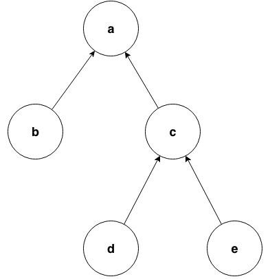

:tocdepth: 1

.. _expressions:

Expressions
###########

An expression evaluates to a set of values and has a type.

For example, the expression ``1 + 2`` 
evaluates to the integer ``3`` and the expression ``"QL"`` evaluates to the string ``"QL"``. ``1 + 2`` has :ref:`type <types>` ``int`` and ``"QL"`` has type ``string``.

The following sections describe the expressions that are available in QL.

Variable references
*******************

A variable reference is the name of a declared :ref:`variable <variables>`. This kind of 
expression has the same type as the variable it refers to.

For example, if you have :ref:`declared <variable-declarations>` the variables ``int i`` and ``LocalScopeVariable lsv``, then 
the expressions ``i`` and ``lsv`` have types ``int`` and ``LocalScopeVariable`` respectively.

You can also refer to the variables ``this`` and ``result``. These are used in :ref:`predicate
<predicates>` definitions and act in the same way as other variable references.

.. index:: literal

Literals
********

You can express certain values directly in QL, such as numbers, booleans, and strings.

- :ref:`Boolean <boolean>` literals: These are the values ``true`` and ``false``.

- :ref:`Integer <int>` literals: These are sequences of decimal digits (``0`` through ``9``),
  possibly starting with a minus sign (``-``).
  For example:

  .. code-block:: ql

    0
    42
    -2048 

- :ref:`Float <float>` literals: These are sequences of decimal digits separated by a dot 
  (``.``), possibly starting with a minus sign (``-``).
  For example:
  
  .. code-block:: ql
      
    2.0
    123.456
    -100.5

- :ref:`String <string>` literals: These are finite strings of 16-bit characters. You can 
  define a string literal by enclosing characters in quotation marks (``"..."``). Most 
  characters represent themselves, but there are a few characters that you need to "escape"
  with a backslash. The following are examples of string literals:

  .. code-block:: ql

    "hello"
    "They said, \"Please escape quotation marks!\""
  
  See `String literals <https://codeql.github.com/docs/ql-language-reference/ql-language-specification/#string-literals-string>`__
  in the QL language specification for more details. 
    
  Note: there is no "date literal" in QL. Instead, to specify a :ref:`date <date>`, you should
  convert a string to the date that it represents using the ``toDate()`` predicate. For example,
  ``"2016-04-03".toDate()`` is the date April 3, 2016, and ``"2000-01-01 00:00:01".toDate()`` is the
  point in time one second after New Year 2000.
  
  The following string formats are recognized as dates:
   - **ISO dates**, such as ``"2016-04-03 17:00:24"``. The seconds part is optional (assumed 
     to be ``"00"`` if it's missing), and the entire time part can also be missing (in which 
     case it's assumed to be ``"00:00:00"``).
   - **Short-hand ISO dates**, such as ``"20160403"``.
   - **UK-style dates**, such as ``"03/04/2016"``.
   - **Verbose dates**, such as ``"03 April 2016"``.

Parenthesized expressions
*************************

A parenthesized expression is an expression surrounded by parentheses, ``(`` and ``)``. This 
expression has exactly the same type and values as the original expression. 
Parentheses are useful for grouping expressions together to remove ambiguity and improve
readability.

.. index:: range
.. _ranges:

Ranges
******

A range expression denotes a range of values ordered between two expressions. It consists of 
two expressions separated by ``..`` and enclosed in brackets (``[`` and ``]``). 
For example, ``[3 .. 7]`` is a valid range expression. Its values are any integers between 
``3`` and ``7`` (including ``3`` and ``7`` themselves).

In a valid range, the start and end expression are integers, floats, or dates. If one of them 
is a date, then both must be dates. If one of them is an integer and the other a float, then
both are treated as floats.

.. index:: setliteral
.. _setliteral:

Set literal expressions
***********************

A set literal expression allows the explicit listing of a choice between several values.
It consists of a comma-separated collection of expressions that are enclosed in brackets (``[`` and ``]``).
For example, ``[2, 3, 5, 7, 11, 13, 17, 19, 23, 29]`` is a valid set literal expression.
Its values are the first ten prime numbers.

The values of the contained expressions need to be of :ref:`compatible types <type-compatibility>` for a valid set literal expression.
Furthermore, at least one of the set elements has to be of a type that is a supertype of the types of all
the other contained expressions.

Set literals are supported from release 2.1.0 of the CodeQL CLI, and release 1.24 of LGTM Enterprise.

.. index:: super
.. _super:

Super expressions
*****************

Super expressions in QL are similar to super expressions in other programming languages, such
as Java. You can use them in predicate calls, when you want to use the predicate definition 
from a supertype. In practice, this is useful when a predicate inherits two definitions from 
its supertypes. In that case, the predicate must :ref:`override <overriding-member-predicates>`
those definitions to avoid ambiguity.
However, if you want to use the definition from a particular supertype instead of writing a 
new definition, you can use a super expression.

In the following example, the class ``C`` inherits two definitions of the predicate 
``getANumber()``—one from ``A`` and one from ``B``. 
Instead of overriding both definitions, it uses the definition from ``B``.

.. code-block:: ql
   
    class A extends int {
      A() { this = 1 }
      int getANumber() { result = 2 }
    }
    
    class B extends int {
      B() { this = 1 }
      int getANumber() { result = 3 }
    }
    
    class C extends A, B {
      // Need to define `int getANumber()`; otherwise it would be ambiguous
      int getANumber() { 
        result = B.super.getANumber()
      }
    }
    
    from C c
    select c, c.getANumber()

The result of this query is ``1, 3``.

.. _calls-with-result:

Calls to predicates (with result)
*********************************

Calls to :ref:`predicates with results <predicates-with-result>` are themselves expressions,
unlike calls to :ref:`predicates without results <predicates-without-result>` which are
formulas. For more information, see ":ref:`calls`."

A call to a predicate with result evaluates to the values of the ``result`` variable of the
called predicate.

For example ``a.getAChild()`` is a call to a predicate ``getAChild()`` on a variable ``a``.
This call evaluates to the set of children of ``a``.

.. index:: aggregate
.. _aggregations:

Aggregations
************

An aggregation is a mapping that computes a result value from a set of input values that are
specified by a formula. 

The general syntax is:

.. code-block:: ql

    <aggregate>(<variable declarations> | <formula> | <expression>)

The variables :ref:`declared <variable-declarations>` in ``<variable declarations>`` are called
the **aggregation variables**.

Ordered aggregates (namely ``min``, ``max``, ``rank``, ``concat``, and ``strictconcat``) are
ordered by their ``<expression>`` values by default. The ordering is either numeric (for 
integers and floating point numbers) or lexicographic (for strings). Lexicographic ordering is
based on the `Unicode value <https://en.wikipedia.org/wiki/List_of_Unicode_characters#Basic_Latin>`_
of each character.

To specify a different order, follow ``<expression>`` with the keywords ``order by``, then
one or more comma-separated expressions that specify the order, and optionally the keyword ``asc`` or ``desc`` after each expression
(to determine whether to order the expression in ascending or descending order). If you don't
specify an ordering, it defaults to ``asc``. For example, ``order by o.getName() asc, o.getSize() desc``
might be used to order some object by name, breaking ties by descending size.

The following aggregates are available in QL:

.. index:: count

- ``count``: This aggregate determines the number of distinct values of ``<expression>`` for
  each possible assignment of the aggregation variables.
  
  For example, the following aggregation returns the number of files that have more than 
  ``500`` lines:

  .. code-block:: ql

      count(File f | f.getTotalNumberOfLines() > 500 | f)
  
  If there are no possible assignments to the aggregation variables that satisfy the formula, as in 
  ``count(int i | i = 1 and i = 2 | i)``, then ``count`` defaults to the value ``0``.

.. index:: min, max, minimum, maximum

- ``min`` and ``max``: These aggregates determine the smallest (``min``) or largest (``max``)
  value of ``<expression>`` among the possible assignments to the aggregation variables. 
  ``<expression>`` must be of numeric type or of type ``string``, or an explicit order must be defined with ``order by``.
  When using ``order by``, more than one result may exist in case of ties.
  
  For example, the following aggregation returns the name of the ``.js`` file (or files) with the 
  largest number of lines, using the number of lines of code to break ties:

  .. code-block:: ql

      max(File f | f.getExtension() = "js" | f.getBaseName() order by f.getTotalNumberOfLines(), f.getNumberOfLinesOfCode())

  The following aggregation returns the minimum string ``s`` out of the three strings mentioned
  below, that is, the string that comes first in the lexicographic ordering of all the possible
  values of ``s``. (In this case, it returns ``"De Morgan"``.)
  
  .. code-block:: ql

      min(string s | s = "Tarski" or s = "Dedekind" or s = "De Morgan" | s)

.. index:: avg, average

- ``avg``: This aggregate determines the average value of ``<expression>`` for all possible
  assignments to the aggregation variables. The type of ``<expression>`` must be numeric.
  If there are no possible assignments to the aggregation variables that satisfy the formula, the aggregation fails and
  returns no values. In other words, it evaluates to the empty set.
  
  For example, the following aggregation returns the average of the integers ``0``, ``1``,
  ``2``, and ``3``:

  .. code-block:: ql

      avg(int i | i = [0 .. 3] | i)

.. index:: sum

- ``sum``: This aggregate determines the sum of the values of ``<expression>`` over all possible 
  assignments to the aggregation variables. The type of ``<expression>`` must be numeric. 
  If there are no possible assignments to the aggregation variables that satisfy the formula, then the sum is ``0``.

  For example, the following aggregation returns the sum of ``i * j`` for all possible values
  of ``i`` and ``j``:

  .. code-block:: ql

      sum(int i, int j | i = [0 .. 2] and j = [3 .. 5] | i * j)

.. index:: concat

- ``concat``: This aggregate concatenates the values of ``<expression>`` over all possible 
  assignments to the aggregation variables. Note that ``<expression>`` must be of type 
  ``string``. If there are no possible assignments to the aggregation variables that satisfy
  the formula, then ``concat`` defaults to the empty string.

  For example, the following aggregation returns the string ``"3210"``, that is, the
  concatenation of the strings ``"0"``, ``"1"``, ``"2"``, and ``"3"`` in descending order:

  .. code-block:: ql

      concat(int i | i = [0 .. 3] | i.toString() order by i desc)

  The ``concat`` aggregate can also take a second expression, separated from the first one by
  a comma. This second expression is inserted as a separator between each concatenated value.

  For example, the following aggregation returns ``"0|1|2|3"``:

  .. code-block:: ql

      concat(int i | i = [0 .. 3] | i.toString(), "|")

.. index:: rank

- ``rank``: This aggregate takes the possible values of ``<expression>`` and ranks them. 
  ``<expression>`` must be of numeric type or of type ``string``, or an explicit order must be defined with ``order by``.
  The aggregation returns the value that is ranked in the position specified by the **rank expression**.
  You must include this rank expression in brackets after the keyword ``rank``.
  When using ``order by``, more than one result may exist in case of ties.

  For example, the following aggregation returns the value that is ranked 4th out of all the
  possible values. In this case, ``8`` is the 4th integer in the range from ``5`` through
  ``15``:

  .. code-block:: ql

      rank[4](int i | i = [5 .. 15] | i)

  .. pull-quote:: Note

     - Rank indices start at ``1``, so ``rank[0](...)`` has no result.
     - ``rank[1](...)`` is the same as ``min(...)``.

.. index:: strictconcat, strictcount, strictsum

- ``strictconcat``, ``strictcount``, and ``strictsum``: These aggregates work like ``concat``,
  ``count``, and ``sum`` respectively, except that they are *strict*. That is, if there are no
  possible assignments to the aggregation variables that satisfy the formula, then the entire aggregation fails and
  evaluates to the empty set (instead of defaulting to ``0`` or the empty string).
  This is useful if you're only interested in results where the aggregation body is non-trivial.

.. index:: unique

- ``unique``: This aggregate depends on the values of ``<expression>`` over all possible assignments to
  the aggregation variables. If there is a unique value of ``<expression>`` over the aggregation variables,
  then the aggregate evaluates to that value.
  Otherwise, the aggregate has no value.

  For example, the following query returns the positive integers ``1``, ``2``, ``3``, ``4``, ``5``.
  For negative integers ``x``, the expressions ``x`` and ``x.abs()`` have different values, so the
  value for ``y`` in the aggregate expression is not uniquely determined.

  .. code-block:: ql

      from int x
      where x in [-5 .. 5] and x != 0
      select unique(int y | y = x or y = x.abs() | y)

  The ``unique`` aggregate is supported from release 2.1.0 of the CodeQL CLI, and release 1.24 of LGTM Enterprise.

Evaluation of aggregates
========================

In general, aggregate evaluation involves the following steps:

#. Determine the input variables: these are the aggregation variables declared in ``<variable declarations>`` and 
   also the variables declared outside of the aggregate that are used in some component of the aggregate.

#. Generate all possible distinct tuples (combinations) of the values of input variables such that the
   ``<formula>`` holds true. Note that the same value of an aggregate variable may appear in 
   multiple distinct tuples. All such occurrences of the same value are treated as distinct occurrences 
   when processing tuples.

#. Apply ``<expression>`` on each tuple and collect the generated (distinct) values. The application 
   of ``<expression>`` on a tuple may result in generating more than one value.

#. Apply the aggregation function on the values generated in step 3 to compute the final result.

Let us apply these steps to the ``sum`` aggregate in the following query:

.. code-block:: ql

   select sum(int i, int j |
       exists(string s | s = "hello".charAt(i)) and exists(string s | s = "world!".charAt(j)) | i)

#. Input variables: ``i``, ``j``.

#. All possible tuples ``(<value of i>, <value of j>)`` satisfying the given condition: 
   ``(0, 0), (0, 1), (0, 2), (0, 3), (0, 4), (0, 5), (1, 0), (1, 1), ..., (4, 5)``.

   30 tuples are generated in this step.

#. Apply the ``<expression> i`` on all tuples. This means selecting all values of ``i`` from 
   all tuples: ``0, 0, 0, 0, 0, 0, 1, 1, 1, 1, 1, 1, 2, 2, 2, 2, 2, 2, 3, 3, 3, 3, 3, 3, 4, 4, 4, 4, 4, 4.``

#. Apply the aggregation function ``sum`` on the above values to get the final result ``60``.

If we change ``<expression>`` to ``i + j`` in the above query, the query result is ``135`` since 
applying ``i + j`` on all tuples results in following values:
\ ``0, 1, 2, 3, 4, 5, 1, 2, 3, 4, 5, 6, 2, 3, 4, 5, 6, 7, 3, 4, 5, 6, 7, 8, 4, 5, 6, 7, 8, 9``.

Next, consider the following query:

.. code-block:: ql
 
   select count(string s | s = "hello" | s.charAt(_))

#. ``s`` is the input variable of the aggregate.

#. A single tuple ``"hello"`` is generated in this step.

#. The ``<expression> charAt(_)`` is applied on this tuple. The underscore ``_`` in ``charAt(_)``
   is a :ref:`don't-care expression <don-t-care-expressions>`, which represents any value.
   ``s.charAt(_)`` generates four distinct values ``h, e, l, o``.

#. Finally, ``count`` is applied on these values, and the query returns ``4``.  

Omitting parts of an aggregation
================================

The three parts of an aggregation are not always required, so you can often write the 
aggregation in a simpler form:

#. If you want to write an aggregation of the form ``<aggregate>(<type> v | <expression> = v | v)``,
   then you can omit the ``<variable declarations>`` and ``<formula>`` parts and write it 
   as follows:

   .. code-block:: ql

       <aggregate>(<expression>)

   For example, the following aggregations determine how many times the letter ``l`` occurs in
   string ``"hello"``. These forms are equivalent:

   .. code-block:: ql
   
       count(int i | i = "hello".indexOf("l") | i)
       count("hello".indexOf("l"))

#. If there is only one aggregation variable, you can omit the ``<expression>`` part instead.
   In this case, the expression is considered to be the aggregation variable itself.
   For example, the following aggregations are equivalent:

   .. code-block:: ql

       avg(int i | i = [0 .. 3] | i)
       avg(int i | i = [0 .. 3])
   
#. As a special case, you can omit the ``<expression>`` part from ``count`` even if there is more
   than one aggregation variable. In such a case, it counts the number of distinct tuples of
   aggregation variables that satisfy the formula. In other words, the expression part is
   considered to be the constant ``1``. For example, the following aggregations are equivalent:

   .. code-block:: ql
  
       count(int i, int j | i in [1 .. 3] and j in [1 .. 3] | 1)
       count(int i, int j | i in [1 .. 3] and j in [1 .. 3])

#. You can omit the ``<formula>`` part, but in that case you should include two vertical bars:

   .. code-block:: ql

       <aggregate>(<variable declarations> | | <expression>)

   This is useful if you don't want to restrict the aggregation variables any further. 
   For example, the following aggregation returns the maximum number of lines across all files:

   .. code-block:: ql

       max(File f | | f.getTotalNumberOfLines())

#. Finally, you can also omit both the ``<formula>`` and ``<expression>`` parts. For example,
   the following aggregations are equivalent ways to count the number of files in a database:

   .. code-block:: ql

       count(File f | any() | 1)
       count(File f | | 1)
       count(File f)

.. _monotonic-aggregates:

Monotonic aggregates
====================

In addition to standard aggregates, QL also supports monotonic aggregates.
Monotonic aggregates differ from standard aggregates in the way that they deal with the
values generated by the ``<expression>`` part of the formula:

- Standard aggregates take the ``<expression>`` values for each ``<formula>`` value and 
  flatten them into a list. A single aggregation function is applied to all the values.
- Monotonic aggregates take an ``<expression>`` for each value given by the ``<formula>``, 
  and create combinations of all the possible values. The aggregation 
  function is applied to each of the resulting combinations.

In general, if the ``<expression>`` is total and functional, then monotonic aggregates are 
equivalent to standard aggregates. Results differ when there is not precisely one ``<expression>`` 
value for each value generated by the ``<formula>``:

- If there are missing ``<expression>`` values (that is, there is no 
  ``<expression>`` value for a value generated by the ``<formula>``), monotonic aggregates 
  won't compute a result, as you cannot create combinations of values  
  including exactly one ``<expression>`` value for each value generated by the ``<formula>``.

- If there is more than one ``<expression>`` per ``<formula>`` result, you can create multiple 
  combinations of values including exactly one ``<expression>`` value for each 
  value generated by the ``<formula>``. Here, the aggregation function is applied to each of the 
  resulting combinations.

Example of monotonic aggregates
-------------------------------

Consider this query:

.. code-block:: ql

   string getPerson() { result = "Alice" or
                        result = "Bob" or
                        result = "Charles" or
                        result = "Diane"
                      }
   string getFruit(string p) { p = "Alice"   and result = "Orange" or
                               p = "Alice"   and result = "Apple" or
                               p = "Bob"     and result = "Apple" or
                               p = "Charles" and result = "Apple" or
                               p = "Charles" and result = "Banana"
                             }
   int getPrice(string f) { f = "Apple"  and result = 100 or
                            f = "Orange" and result = 100 or
                            f = "Orange" and result =   1
                          }

   predicate nonmono(string p, int cost) {
     p = getPerson() and cost = sum(string f | f = getFruit(p) | getPrice(f))
   }

   language[monotonicAggregates]
   predicate mono(string p, int cost) {
     p = getPerson() and cost = sum(string f | f = getFruit(p) | getPrice(f))
   }

   from string variant, string person, int cost
   where variant = "default"  and nonmono(person, cost) or
         variant = "monotonic" and mono(person, cost)
   select variant, person, cost
   order by variant, person

The query produces these results:

+-----------+---------+------+
|  variant  | person  | cost |
+===========+=========+======+
| default   | Alice   | 201  |
+-----------+---------+------+
| default   | Bob     | 100  |
+-----------+---------+------+
| default   | Charles | 100  |
+-----------+---------+------+
| default   | Diane   | 0    |
+-----------+---------+------+
| monotonic | Alice   | 101  |
+-----------+---------+------+
| monotonic | Alice   | 200  |
+-----------+---------+------+
| monotonic | Bob     | 100  |
+-----------+---------+------+
| monotonic | Diane   | 0    |
+-----------+---------+------+

The two variants of the aggregate semantics differ in what happens
when ``getPrice(f)`` has either multiple results or no results
for a given ``f``.

In this query, oranges are available at two different prices, and the
default ``sum`` aggregate returns a single line where Alice buys an
orange at a price of 100, another orange at a price of 1, and an apple
at a price of 100, totalling 201. On the other hand, in the the
*monotonic* semantics for ``sum``, Alice always buys one orange and
one apple, and a line of output is produced for each *way* she can
complete her shopping list.

If there had been two different prices for apples too, the monotonic
``sum`` would have produced *four* output lines for Alice.

Charles wants to buy a banana, which is not for sale at all. In the
default case, the sum produced for Charles includes the cost of the
apple he *can* buy, but there's no line for Charles in the monontonic
``sum`` output, because there *is no way* for Charles to buy one apple
plus one banana.

(Diane buys no fruit at all, and in both variants her total cost
is 0. The ``strictsum`` aggregate would have excluded her from the
results in both cases).

In actual QL practice, it is quite rare to use monotonic aggregates
with the *goal* of having multiple output lines, as in the "Alice"
case of this example. The more significant point is the "Charles"
case: As long as there's no price for bananas, no output is produced
for him. This means that if we later do learn of a banana price, we
don't need to *remove* any output tuple already produced. The
importance of this is that the monotonic aggregate behavior works well
with a fixpoint-based semantics for recursion, so it will be meaningul
to let the ``getPrice`` predicate be mutually recursive with the count
aggregate itself. (On the other hand, ``getFruit`` still cannot be
allowed to be recursive, because adding another fruit to someone's
shopping list would invalidate the total costs we already knew for
them).

This opportunity to use recursion is the main practical reason for
requesting monotonic semantics of aggregates.

Recursive monotonic aggregates
------------------------------

Monotonic aggregates may be used :ref:`recursively <recursion>`, but the recursive call may only appear in the 
expression, and not in the range. The recursive semantics for aggregates are the same as the
recursive semantics for the rest of QL. For example, we might define a predicate to calculate 
the distance of a node in a graph from the leaves as follows:

.. code-block:: ql

   int depth(Node n) {
     if not exists(n.getAChild())
     then result = 0
     else result = 1 + max(Node child | child = n.getAChild() | depth(child))
   }

Here the recursive call is in the expression, which is legal. The recursive semantics for aggregates 
are the same as the recursive semantics for the rest of QL. If you understand how aggregates work in 
the non-recursive case then you should not find it difficult to use them recursively. However, it is 
worth seeing how the evaluation of a recursive aggregation proceeds.

Consider the depth example we just saw with the following graph as input (arrows point from children to parents):

|image0|

Then the evaluation of the ``depth`` predicate proceeds as follows:

+-----------+--------------------------------------------+--------------------------------------------------------------------------------------------------------------------------------------------------------------------------+
| **Stage** | **depth**                                  | **Comments**                                                                                                                                                             |
+===========+============================================+==========================================================================================================================================================================+
| 0         |                                            | We always begin with the empty set.                                                                                                                                      |
+-----------+--------------------------------------------+--------------------------------------------------------------------------------------------------------------------------------------------------------------------------+
| 1         | ``(0, b), (0, d), (0, e)``                 | The nodes with no children have depth 0. The recursive step for **a** and **c** fails to produce a value, since some of their children do not have values for ``depth``. |
+-----------+--------------------------------------------+--------------------------------------------------------------------------------------------------------------------------------------------------------------------------+
| 2         | ``(0, b), (0, d), (0, e), (1, c)``         | The recursive step for **c** succeeds, since ``depth`` now has a value for all its children (**d** and **e**). The recursive step for **a** still fails.                 |
+-----------+--------------------------------------------+--------------------------------------------------------------------------------------------------------------------------------------------------------------------------+
| 3         | ``(0, b), (0, d), (0, e), (1, c), (2, a)`` | The recursive step for **a** succeeds, since ``depth`` now has a value for all its children (**b** and **c**).                                                           |
+-----------+--------------------------------------------+--------------------------------------------------------------------------------------------------------------------------------------------------------------------------+

Here, we can see that at the intermediate stages it is very important for the aggregate to 
fail if some of the children lack a value - this prevents erroneous values being added.

.. index:: any

Any
***

The general syntax of an ``any`` expression is similar to the syntax of an
:ref:`aggregation <aggregations>`, namely:

.. code-block:: ql

    any(<variable declarations> | <formula> | <expression>)

You should always include the :ref:`variable declarations <variable-declarations>`, but the
:ref:`formula <formulas>` and :ref:`expression <expressions>` parts are optional.

The ``any`` expression denotes any values that are of a particular form and that satisfy a
particular condition.
More precisely, the ``any`` expression:

#. Introduces temporary variables.
#. Restricts their values to those that satisfy the ``<formula>`` part (if it's present).
#. Returns ``<expression>`` for each of those variables. If there is no ``<expression>`` part,
   then it returns the variables themselves.

The following table lists some examples of different forms of ``any`` expressions:

+------------------------------------------+-------------------------------------------------+
| Expression                               | Values                                          |
+==========================================+=================================================+
| ``any(File f)``                          | all ``File``\ s in the database                 |
+------------------------------------------+-------------------------------------------------+
| ``any(Element e | e.getName())``         | the names of all ``Element``\ s in the database |
+------------------------------------------+-------------------------------------------------+
| ``any(int i | i = [0 .. 3])``            | the integers ``0``, ``1``, ``2``, and ``3``     |
+------------------------------------------+-------------------------------------------------+
| ``any(int i | i = [0 .. 3] | i * i)``    | the integers ``0``, ``1``, ``4``, and ``9``     |
+------------------------------------------+-------------------------------------------------+

.. pull-quote:: Note

   There is also a `built-in predicate <https://codeql.github.com/docs/ql-language-reference/ql-language-specification/#non-member-built-ins>`_
   ``any()``. This is a predicate that always holds.

Unary operations
****************

A unary operation is a minus sign (``-``) or a plus sign (``+``) followed by an expression of type
``int`` or ``float``. For example:

.. code-block:: ql

    -6.28
    +(10 - 4)
    +avg(float f | f = 3.4 or f = -9.8)
    -sum(int i | i in [0 .. 9] | i * i)

A plus sign leaves the values of the expression unchanged, while a minus sign takes the
arithmetic negations of the values.

.. _binary-operations:

Binary operations
*****************

A binary operation consists of an expression, followed by a binary operator, followed by 
another expression. For example:

.. code-block:: ql

    5 % 2
    (9 + 1) / (-2)
    "Q" + "L"
    2 * min(float f | f in [-3 .. 3])

.. index:: addition, concatenation, multiplication, division, subtraction, modulo
   seealso: concatenation; concat

You can use the following binary operators in QL:

+------------------------+--------+
| Name                   | Symbol |
+========================+========+
| Addition/concatenation | ``+``  |
+------------------------+--------+
| Multiplication         | ``*``  |
+------------------------+--------+
| Division               | ``/``  |
+------------------------+--------+
| Subtraction            | ``-``  |
+------------------------+--------+
| Modulo                 | ``%``  |
+------------------------+--------+

If both expressions are numbers, these operators act as standard arithmetic operators. For 
example, ``10.6 - 3.2`` has value ``7.4``, ``123.456 * 0`` has value ``0``, and ``9 % 4`` has 
value ``1`` (the remainder after dividing ``9`` by ``4``).
If both operands are integers, then the result is an integer. Otherwise the result is a 
floating-point number.

You can also use ``+`` as a string concatenation operator. In this case, at least one of the 
expressions must be a string—the other expression is implicitly converted to a string using the
``toString()`` predicate. The two expressions are concatenated, and the result is a string. For
example, the expression ``221 + "B"`` has value ``"221B"``.

.. _casts:

Casts
*****

A cast allows you to constrain the :ref:`type <types>` of an expression. This is similar to casting in other 
languages, for example in Java. 

You can write a cast in two ways: 
  - As a "postfix" cast: A dot followed by the name of a type in parentheses. 
    For example, ``x.(Foo)`` restricts the type of ``x`` to ``Foo``.
  - As a "prefix" cast: A type in parentheses followed by another expression. 
    For example, ``(Foo)x`` also restricts the type of ``x`` to ``Foo``.

Note that a postfix cast is equivalent to a prefix cast surrounded by parentheses—``x.(Foo)``
is exactly equivalent to ``((Foo)x)``.

Casts are useful if you want to call a :ref:`member predicate <member-predicates>` that is only defined for a more 
specific type. For example, the following query selects Java 
`classes <https://codeql.github.com/codeql-standard-libraries/java/semmle/code/java/Type.qll/type.Type$Class.html>`_
that have a direct supertype called "List":

.. code-block:: ql

    import java
    
    from Type t
    where t.(Class).getASupertype().hasName("List")    
    select t

Since the predicate ``getASupertype()`` is defined for ``Class``, but not for ``Type``, you 
can't call ``t.getASupertype()`` directly. The cast ``t.(Class)`` ensures that ``t`` is
of type ``Class``, so it has access to the desired predicate.

If you prefer to use a prefix cast, you can rewrite the ``where`` part as:

.. code-block:: ql

    where ((Class)t).getASupertype().hasName("List")

.. index:: underscore
.. _don-t-care-expressions:

Don't-care expressions
**********************

This is an expression written as a single underscore ``_``. It represents any value. (You 
"don't care" what the value is.) 

Unlike other expressions, a don't-care expression does not have a type. In practice, this 
means that ``_`` doesn't have any :ref:`member predicates <member-predicates>`, so you can't
call ``_.somePredicate()``.

For example, the following query selects all the characters in the string ``"hello"``:

.. code-block:: ql

    from string s
    where s = "hello".charAt(_)
    select s

The ``charAt(int i)`` predicate is defined on strings and usually takes an ``int`` argument.
Here the don't care expression ``_`` is used to tell the query to select characters at
every possible index. The query returns the values ``h``, ``e``, ``l``, and ``o``.
