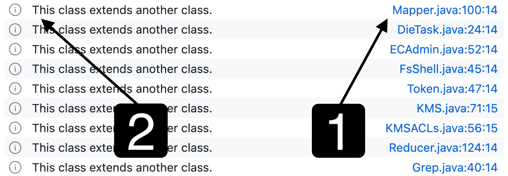
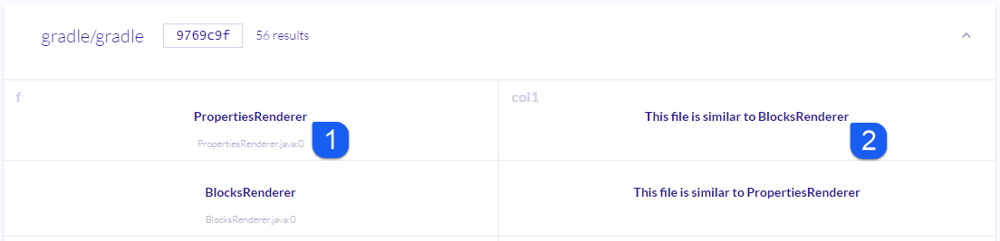
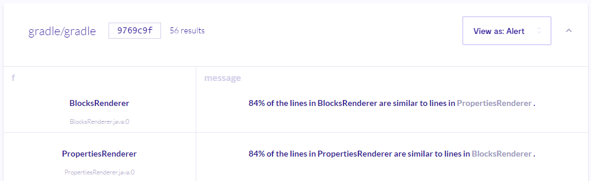

.. _defining-the-results-of-a-query:

Defining the results of a query
===============================

You can control how analysis results are displayed in source code by modifying a query's ``select`` statement.

About query results
-------------------

The information contained in the results of a query is controlled by the ``select`` statement. Part of the process of developing a useful query is to make the results clear and easy for other users to understand.
When you write your own queries in the query console or in the CodeQL :ref:`extension for VS Code <codeql-for-visual-studio-code>` there are no constraints on what can be selected.
However, if you want to use a query to create alerts in LGTM or generate valid analysis results using the :ref:`CodeQL CLI <codeql-cli>`, you'll need to make the ``select`` statement report results in the required format. 
You must also ensure that the query has the appropriate metadata properties defined. 
This topic explains how to write your select statement to generate helpful analysis results. 

Overview
--------

Alert queries must have the property ``@kind problem`` defined in their metadata. For more information, see ":doc:`Metadata for CodeQL queries <metadata-for-codeql-queries>`." 
In their most basic form, the ``select`` statement must select two 'columns':

-  **Element**—a code element that's identified by the query. This defines the location of the alert.
-  **String**—a message to display for this code element, describing why the alert was generated.

If you look at some of the LGTM queries, you'll see that they can select extra element/string pairs, which are combined with ``$@`` placeholder markers in the message to form links. For example, `Dereferenced variable may be null <https://lgtm.com/query/rule:1954750296/lang:java/>`__ (Java), or `Duplicate switch case <https://lgtm.com/query/rule:7890077/lang:javascript/>`__ (JavaScript). 

.. pull-quote::

    Note

    An in-depth discussion of ``select`` statements for path queries is not included in this topic. However, you can develop the string column of the ``select`` statement in the same way as for alert queries. For more specific information about path queries, see ":doc:`Creating path queries <creating-path-queries>`."

Developing a select statement
-----------------------------

Here's a simple query that uses the standard CodeQL ``CodeDuplication.qll`` library to identify similar files.

Basic select statement
~~~~~~~~~~~~~~~~~~~~~~

.. code-block:: ql

   import java
   import external.CodeDuplication

   from File f, File other, int percent
   where similarFiles(f, other, percent)
   select f, "This file is similar to another file."

This basic select statement has two columns:

#. Element to display the alert on: ``f`` corresponds to ``File``.
#. String message to display: ``"This file is similar to another file."``

Including the name of the similar file
~~~~~~~~~~~~~~~~~~~~~~~~~~~~~~~~~~~~~~

The alert message defined by the basic select statement is constant and doesn't give users much information. Since the query identifies the similar file (``other``), it's easy to extend the ``select`` statement to report the name of the similar file. For example:

.. code-block:: ql

   select f, "This file is similar to " + other.getBaseName()

#. Element: ``f`` as before.
#. String message: ``"This file is similar to "``—the string text is combined with the file name for the ``other``, similar file, returned by ``getBaseName()``.

While this is more informative than the original select statement, the user still needs to find the other file manually.

Adding a link to the similar file
~~~~~~~~~~~~~~~~~~~~~~~~~~~~~~~~~

You can use placeholders in the text of alert messages to insert additional information, such as links to the similar file. Placeholders are defined using ``$@``, and filled using the information in the next two columns of the select statement. For example, this select statement returns four columns:

.. code-block:: ql

   select f, "This file is similar to $@.", other, other.getBaseName()

#. Element: ``f`` as before.
#. String message: ``"This file is similar to $@."``—the string text now includes a placeholder, which will display the combined content of the next two columns.
#. Element for placeholder: ``other`` corresponds to the similar file.
#. String text for placeholder: the short file name returned by ``other.getBaseName()``.

When the alert message is displayed, the ``$@`` placeholder is replaced by a link created from the contents of the third and fourth columns defined by the ``select`` statement.

If you use the ``$@`` placeholder marker multiple times in the description text, then the ``N``\ th use is replaced by a link formed from columns ``2N+2`` and ``2N+3``. If there are more pairs of additional columns than there are placeholder markers, then the trailing columns are ignored. Conversely, if there are fewer pairs of additional columns than there are placeholder markers, then the trailing markers are treated as normal text rather than placeholder markers.

Adding details of the extent of similarity
~~~~~~~~~~~~~~~~~~~~~~~~~~~~~~~~~~~~~~~~~~

You could go further and change the ``select`` statement to report on the similarity of content in the two files, since this information is already available in the query. For example:

.. code-block:: ql

   select f, percent + "% of the lines in " + f.getBaseName() + " are similar to lines in $@.", other, other.getBaseName()

The new elements added here don't need to be clickable, so we added them directly to the description string.

Further reading
---------------

- `CodeQL repository <https://github.com/github/codeql>`__
