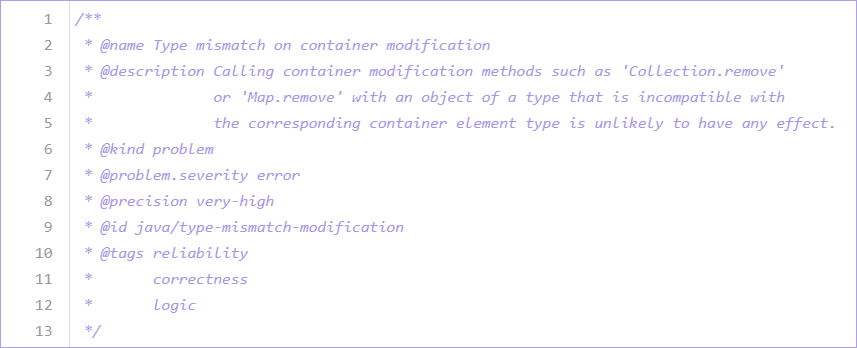

.. _metadata-for-codeql-queries:

Metadata for CodeQL queries
===========================

Metadata tells users important information about CodeQL queries. You must include the correct query metadata in a query to be able to view query results in source code.

About query metadata
--------------------

Any query that is run as part of an analysis includes a number of properties, known as query metadata. Metadata is included at the top of each query file as the content of a QLDoc comment.
This metadata tells the CodeQL `extension for VS Code <https://docs.github.com/en/code-security/codeql-for-vs-code/>`__ and the `Code scanning feature in GitHub <https://docs.github.com/en/code-security/code-scanning/automatically-scanning-your-code-for-vulnerabilities-and-errors/about-code-scanning-with-codeql>`__ how to handle the query and display its results correctly.
It also gives other users information about what the query results mean. For more information on query metadata, see the `query metadata style guide <https://github.com/github/codeql/blob/main/docs/query-metadata-style-guide.md>`__ in our `open source repository <https://github.com/github/codeql>`__ on GitHub.

.. pull-quote::

    Note

    The exact metadata requirement depends on how you are going to run your query. For more information, see the section on query metadata in ":doc:`About CodeQL queries <about-codeql-queries>`."

Metadata properties
-------------------

The following properties are supported by all query files:

+-----------------------+---------------------------+-----------------------------------------------------------------------------------------------------------------------------------------------------------------------------------------------------------------------------------------------------------------------------------------------------------------------------------------------------------------------+
| Property              | Value                     | Description                                                                                                                                                                                                                                                                                                                                                           |
+=======================+===========================+=======================================================================================================================================================================================================================================================================================================================================================================+
| ``@description``      | ``<text>``                | A sentence or short paragraph to describe the purpose of the query and *why* the result is useful or important. The description is written in plain text, and uses single quotes (``'``) to enclose code elements.                                                                                                                                                    |
+-----------------------+---------------------------+-----------------------------------------------------------------------------------------------------------------------------------------------------------------------------------------------------------------------------------------------------------------------------------------------------------------------------------------------------------------------+
| ``@id``               | ``<text>``                | A sequence of words composed of lowercase letters or digits, delimited by ``/`` or ``-``, identifying and classifying the query. Each query must have a **unique** ID. To ensure this, it may be helpful to use a fixed structure for each ID. For example, the standard CodeQL queries have the following format: ``<language>/<brief-description>``.                |
+-----------------------+---------------------------+-----------------------------------------------------------------------------------------------------------------------------------------------------------------------------------------------------------------------------------------------------------------------------------------------------------------------------------------------------------------------+
| ``@kind``             | | ``problem``             | Identifies the query is an alert (``@kind problem``) or a path (``@kind path-problem``). For more information on these query types, see ":doc:`About CodeQL queries <about-codeql-queries>`."                                                                                                                                                                         |
|                       | | ``path-problem``        |                                                                                                                                                                                                                                                                                                                                                                       |
+-----------------------+---------------------------+-----------------------------------------------------------------------------------------------------------------------------------------------------------------------------------------------------------------------------------------------------------------------------------------------------------------------------------------------------------------------+
| ``@name``             | ``<text>``                | A statement that defines the label of the query. The name is written in plain text, and uses single quotes (``'``) to enclose code elements.                                                                                                                                                                                                                          |
+-----------------------+---------------------------+-----------------------------------------------------------------------------------------------------------------------------------------------------------------------------------------------------------------------------------------------------------------------------------------------------------------------------------------------------------------------+
| ``@tags``             | | ``correctness``         | These tags group queries together in broad categories to make it easier to search for them and identify them. In addition to the common tags listed here, there are also a number of more specific categories. For more information, see the                                                                                                                          |
|                       | | ``maintainability``     | `Query metadata style guide <https://github.com/github/codeql/blob/main/docs/query-metadata-style-guide.md>`__.                                                                                                                                                                                                                                                       |
|                       | | ``readability``         |                                                                                                                                                                                                                                                                                                                                                                       |
|                       | | ``security``            |                                                                                                                                                                                                                                                                                                                                                                       |
+-----------------------+---------------------------+-----------------------------------------------------------------------------------------------------------------------------------------------------------------------------------------------------------------------------------------------------------------------------------------------------------------------------------------------------------------------+
| ``@precision``        | | ``low``                 | Indicates the percentage of query results that are true positives (as opposed to false positive results). This, along with the ``@problem.severity`` property, determines how the results are displayed on GitHub.                                                                                                                                                    |
|                       | | ``medium``              |                                                                                                                                                                                                                                                                                                                                                                       |
|                       | | ``high``                |                                                                                                                                                                                                                                                                                                                                                                       |
|                       | | ``very-high``           |                                                                                                                                                                                                                                                                                                                                                                       |
+-----------------------+---------------------------+-----------------------------------------------------------------------------------------------------------------------------------------------------------------------------------------------------------------------------------------------------------------------------------------------------------------------------------------------------------------------+
| ``@problem.severity`` | | ``error``               | Defines the level of severity of any alerts generated by a non-security query. This, along with the ``@precision`` property, determines how the results are displayed on GitHub. For more information, see the `Query metadata style guide <https://github.com/github/codeql/blob/main/docs/query-metadata-style-guide.md>`__.                                        |
|                       | | ``warning``             |                                                                                                                                                                                                                                                                                                                                                                       |
|                       | | ``recommendation``      |                                                                                                                                                                                                                                                                                                                                                                       |
+-----------------------+---------------------------+-----------------------------------------------------------------------------------------------------------------------------------------------------------------------------------------------------------------------------------------------------------------------------------------------------------------------------------------------------------------------+
| ``@security-severity``| ``<score>``               | Defines the level of severity, between 0.0 and 10.0, for queries with ``@tags security``. For more information, see the `GitHub user documentation <https://docs.github.com/code-security/code-scanning/managing-code-scanning-alerts/about-code-scanning-alerts#about-alert-severity-and-security-severity-levels>`__.                                               |
+-----------------------+---------------------------+-----------------------------------------------------------------------------------------------------------------------------------------------------------------------------------------------------------------------------------------------------------------------------------------------------------------------------------------------------------------------+

Example
-------

Here is the metadata for one of the standard Java queries:

|image0|

For more examples of query metadata, see the standard CodeQL queries in our `GitHub repository <https://github.com/github/codeql>`__.
