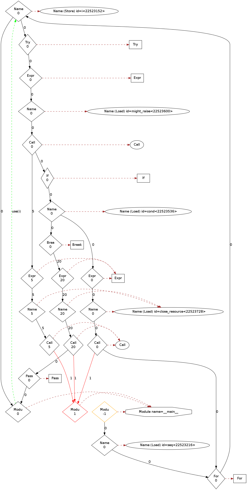

Analyzing control flow in Python
================================

You can write CodeQL queries to explore the control-flow graph of a Python program, for example, to discover unreachable code or mutually exclusive blocks of code.

About analyzing control flow
--------------------------------------

To analyze the control-flow graph of a ``Scope`` we can use the two CodeQL classes ``ControlFlowNode`` and ``BasicBlock``. These classes allow you to ask such questions as "can you reach point A from point B?" or "Is it possible to reach point B *without* going through point A?". To report results we use the class ``AstNode``, which represents a syntactic element and corresponds to the source code - allowing the results of the query to be more easily understood. For more information, see `Control-flow graph <http://en.wikipedia.org/wiki/Control_flow_graph>`__ on Wikipedia.

The ``ControlFlowNode`` class
-----------------------------

The ``ControlFlowNode`` class represents nodes in the control flow graph. There is a one-to-many relation between AST nodes and control flow nodes. Each syntactic element, the ``AstNode,`` maps to zero, one, or many ``ControlFlowNode`` classes, but each ``ControlFlowNode`` maps to exactly one ``AstNode``.

To show why this complex relation is required consider the following Python code:

.. code-block:: python

   try:
       might_raise()
       if cond:
           break
   finally:
       close_resource()

There are many paths through the above code. There are three different paths through the call to ``close_resource();`` one normal path, one path that breaks out of the loop, and one path where an exception is raised by ``might_raise()``. 

An annotated flow graph:

|Python control flow graph|

The simplest use of the ``ControlFlowNode`` and ``AstNode`` classes is to find unreachable code. There is one ``ControlFlowNode`` per path through any ``AstNode`` and any ``AstNode`` that is unreachable has no paths flowing through it. Therefore, any ``AstNode`` without a corresponding ``ControlFlowNode`` is unreachable.

Example finding unreachable AST nodes
^^^^^^^^^^^^^^^^^^^^^^^^^^^^^^^^^^^^^

.. code-block:: ql

   import python

   from AstNode node
   where not exists(node.getAFlowNode())
   select node

➤ `See this in the query console on LGTM.com <https://lgtm.com/query/669220024/>`__. The demo projects on LGTM.com all have some code that has no control flow node, and is therefore unreachable. However, since the ``Module`` class is also a subclass of the ``AstNode`` class, the query also finds any modules implemented in C or with no source code. Therefore, it is better to find all unreachable statements.

Example finding unreachable statements
^^^^^^^^^^^^^^^^^^^^^^^^^^^^^^^^^^^^^^

.. code-block:: ql

   import python

   from Stmt s
   where not exists(s.getAFlowNode())
   select s

➤ `See this in the query console on LGTM.com <https://lgtm.com/query/670720181/>`__. This query gives fewer results, but most of the projects have some unreachable nodes. These are also highlighted by the standard "Unreachable code" query. For more information, see `Unreachable code <https://lgtm.com/rules/3980095>`__ on LGTM.com.

The ``BasicBlock`` class
------------------------

The ``BasicBlock`` class represents a basic block of control flow nodes. The ``BasicBlock`` class is not that useful for writing queries directly, but is very useful for building complex analyses, such as data flow. The reason it is useful is that it shares many of the interesting properties of control flow nodes, such as, what can reach what, and what dominates what, but there are fewer basic blocks than control flow nodes - resulting in queries that are faster and use less memory. For more information, see `Basic block <http://en.wikipedia.org/wiki/Basic_block>`__ and `Dominator <http://en.wikipedia.org/wiki/Dominator_%28graph_theory%29>`__ on Wikipedia.

Example finding mutually exclusive basic blocks
^^^^^^^^^^^^^^^^^^^^^^^^^^^^^^^^^^^^^^^^^^^^^^^

Suppose we have the following Python code:

.. code-block:: python

   if condition():
       return 0
   pass

Can we determine that it is impossible to reach both the ``return 0`` statement and the ``pass`` statement in a single execution of this code? For two basic blocks to be mutually exclusive it must be impossible to reach either of them from the other. We can write:

.. code-block:: ql

   import python

   from BasicBlock b1, BasicBlock b2
   where b1 != b2 and not b1.strictlyReaches(b2) and not b2.strictlyReaches(b1)
   select b1, b2

However, by that definition, two basic blocks are mutually exclusive if they are in different scopes. To make the results more useful, we require that both basic blocks can be reached from the same function entry point:

.. code-block:: ql

   exists(Function shared, BasicBlock entry |
       entry.contains(shared.getEntryNode()) and
       entry.strictlyReaches(b1) and entry.strictlyReaches(b2)
   )

Combining these conditions we get:

Example finding mutually exclusive blocks within the same function
^^^^^^^^^^^^^^^^^^^^^^^^^^^^^^^^^^^^^^^^^^^^^^^^^^^^^^^^^^^^^^^^^^

.. code-block:: ql

   import python

   from BasicBlock b1, BasicBlock b2
   where b1 != b2 and not b1.strictlyReaches(b2) and not b2.strictlyReaches(b1) and
   exists(Function shared, BasicBlock entry |
       entry.contains(shared.getEntryNode()) and
       entry.strictlyReaches(b1) and entry.strictlyReaches(b2)
   )
   select b1, b2

➤ `See this in the query console on LGTM.com <https://lgtm.com/query/671000028/>`__. This typically gives a very large number of results, because it is a common occurrence in normal control flow. It is, however, an example of the sort of control-flow analysis that is possible. Control-flow analyses such as this are an important aid to data flow analysis. For more information, see ":doc:`Analyzing data flow and tracking tainted data in Python <taint-tracking>`."

Further reading
---------------

.. include:: ../../reusables/python-further-reading.rst
.. include:: ../../reusables/codeql-ref-tools-further-reading.rst

