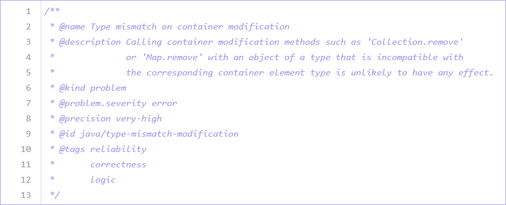

Query metadata
==============

Any query that is run as part of an analysis includes a number of properties, known as query metadata. Metadata is included at the top of each query file as the content of a `QLDoc <https://help.semmle.com/QL/ql-spec/qldoc.html>`__ comment. 
For alerts and path queries, this metadata tells LGTM and the CodeQL `extension for VS Code <https://help.semmle.com/codeql/codeql-for-vscode.html>`__ how to handle the query and display its results correctly. 
It also gives other users information about what the query results mean. For further information on query metadata, see the `query metadata style guide <https://github.com/Semmle/ql/blob/master/docs/query-metadata-style-guide.md#metadata-area>`__ in our `open source repository <https://github.com/semmle/ql>`__ on GitHub.
You can also add metric queries to LGTM, but the results are not shown. To see the results of metric queries, you can run them in the query console or in `Visual Studio Code <https://help.semmle.com/codeql/codeql-for-vscode.html>`__.

.. pull-quote::

    Note

    The exact metadata requirement depends on how you are going to run your query. For more information, see the section on query metadata in :doc:`Introduction to query files <introduction-to-queries>`.
    
Core properties
---------------

The following properties are supported by all query files:

+-----------------------+---------------------------+-----------------------------------------------------------------------------------------------------------------------------------------------------------------------------------------------------------------------------------------------------------------------------------------------------------------------------------------------------------------------------------------------------------------------------------------------------------------------------+
| Property              | Value                     | Description                                                                                                                                                                                                                                                                                                                                                                                                                                                                 |
+=======================+===========================+=============================================================================================================================================================================================================================================================================================================================================================================================================================================================================+
| ``@description``      | ``<text>``                | A sentence or short paragraph to describe the purpose of the query and *why* the result is useful or important. The description is written in plain text, and uses single quotes (``'``) to enclose code elements.                                                                                                                                                                                                                                                          |
+-----------------------+---------------------------+-----------------------------------------------------------------------------------------------------------------------------------------------------------------------------------------------------------------------------------------------------------------------------------------------------------------------------------------------------------------------------------------------------------------------------------------------------------------------------+
| ``@id``               | ``<text>``                | A sequence of words composed of lowercase letters or digits, delimited by ``/`` or ``-``, identifying and classifying the query. Each query must have a **unique** ID. To ensure this, it may be helpful to use a fixed structure for each ID. For example, the standard LGTM queries have the following format: ``<language>/<brief-description>``.                                                                                                                        |
+-----------------------+---------------------------+-----------------------------------------------------------------------------------------------------------------------------------------------------------------------------------------------------------------------------------------------------------------------------------------------------------------------------------------------------------------------------------------------------------------------------------------------------------------------------+
| ``@kind``             | | ``problem``             | Identifies the query is an alert (``@kind problem``), a path (``@kind path-problem``), or a metric (``@kind metric``). For further information on these query types, see :doc:`Introduction to query files <introduction-to-queries>`                                                                                                                                                                                                                                       |
|                       | | ``path-problem``        |                                                                                                                                                                                                                                                                                                                                                                                                                                                                             |
|                       | | ``metric``              |                                                                                                                                                                                                                                                                                                                                                                                                                                                                             |                                  
+-----------------------+---------------------------+-----------------------------------------------------------------------------------------------------------------------------------------------------------------------------------------------------------------------------------------------------------------------------------------------------------------------------------------------------------------------------------------------------------------------------------------------------------------------------+
| ``@name``             | ``<text>``                | A statement that defines the label of the query. The name is written in plain text, and uses single quotes (``'``) to enclose code elements.                                                                                                                                                                                                                                                                                                                                |
+-----------------------+---------------------------+-----------------------------------------------------------------------------------------------------------------------------------------------------------------------------------------------------------------------------------------------------------------------------------------------------------------------------------------------------------------------------------------------------------------------------------------------------------------------------+
| ``@tags``             | | ``correctness``         | These tags group queries together in broad categories to make it easier to search for them and identify them. You can also `filter alerts <https://lgtm.com/help/lgtm/alert-filtering>`__ based on their tags. In addition to the common tags listed here, there are also a number of more specific categories. For more information about some of the tags that are already used and what they mean, see `Query tags <https://lgtm.com/help/lgtm/query-tags>`__.           |
|                       | | ``mantainability``      |                                                                                                                                                                                                                                                                                                                                                                                                                                                                             |
|                       | | ``readability``         |                                                                                                                                                                                                                                                                                                                                                                                                                                                                             |
|                       | | ``security``            |                                                                                                                                                                                                                                                                                                                                                                                                                                                                             |
+-----------------------+---------------------------+-----------------------------------------------------------------------------------------------------------------------------------------------------------------------------------------------------------------------------------------------------------------------------------------------------------------------------------------------------------------------------------------------------------------------------------------------------------------------------+

Additional properties for problem and path-problem queries
----------------------------------------------------------

In addition to the core properties, alert queries (``@kind problem``) and path queries (``@kind path-problem``) support the following properties:

+-----------------------+------------+-----------------------+---------------------------------------------------------------------------------------------------------------------------------------------------------------------------------------------------------------------+
| Property              | Value      | Example               | Notes                                                                                                                                                                                                               |
+=======================+============+=======================+=====================================================================================================================================================================================================================+
| ``@precision``        | ``<type>`` | | ``medium``          | Indicates the percentage of query results that are true positives (as opposed to false positive results). This controls how alerts for problems found by the query are displayed in client applications.            |
|                       |            | | ``high``            |                                                                                                                                                                                                                     |
|                       |            | | ``very-high``       |                                                                                                                                                                                                                     |
+-----------------------+------------+-----------------------+---------------------------------------------------------------------------------------------------------------------------------------------------------------------------------------------------------------------+
| ``@problem.severity`` | ``<type>`` | | ``error``           | Defines the level of severity of any alerts generated by the query. This controls how alerts are displayed in client applications.                                                                                  |
|                       |            | | ``warning``         |                                                                                                                                                                                                                     |
|                       |            | | ``recommendation``  |                                                                                                                                                                                                                     |
+-----------------------+------------+-----------------------+---------------------------------------------------------------------------------------------------------------------------------------------------------------------------------------------------------------------+

Additional properties for metric queries
----------------------------------------

In addition to the core properties, metric queries (``@kind metric``) support the following properties:

+------------------------+--------------+-------------------+----------------------------------------------------------------------------------------------------------------------------------------------------------------------------------------------------------+
| Property               | Value        | Example           | Notes                                                                                                                                                                                                    |
+========================+==============+===================+==========================================================================================================================================================================================================+
| ``@metricType``        | ``<type>``   | | ``file``        | Defines the code element that the query acts on. This information is used by client applications; it should match the type of result returned by the query.                                              |
|                        |              | | ``callable``    |                                                                                                                                                                                                          |
|                        |              | | ``package``     |                                                                                                                                                                                                          |
|                        |              | | ``project``     |                                                                                                                                                                                                          |
|                        |              | | ``reftype``     |                                                                                                                                                                                                          |
+------------------------+--------------+-------------------+----------------------------------------------------------------------------------------------------------------------------------------------------------------------------------------------------------+
| ``@metricAggregate``   | ``<method>`` | | ``avg``         | Defines the allowable aggregations for this metric. A space separated list of the four possibilities ``sum``, ``avg``, ``min`` and ``max``. If it is not present, it defaults to ``sum avg``.            |
|                        |              | | ``sum``         |                                                                                                                                                                                                          |
|                        |              | | ``min``         |                                                                                                                                                                                                          |
|                        |              | | ``max``         |                                                                                                                                                                                                          |
+--------------------+---+--------------+-------------------+----------------------------------------------------------------------------------------------------------------------------------------------------------------------------------------------------------+
| ``@treemap.threshold`` | ``<number>`` | ``10``            | Optional, defines a metric threshold. Used with ``@treemap.warnOn`` to define a "danger area" on the metric charts displayed in client applications.                                                     |
+------------------------+--------------+-------------------+----------------------------------------------------------------------------------------------------------------------------------------------------------------------------------------------------------+
| ``@treemap.warnOn``    | ``<type>``   | | ``highValues``  | Optional, defines whether high or low values are dangerous. Used with ``@treemap.threshold`` to define a "danger area" on the metric charts displayed in client applications.                            |
|                        |              | | ``lowValues``   |                                                                                                                                                                                                          |
+------------------------+--------------+-------------------+----------------------------------------------------------------------------------------------------------------------------------------------------------------------------------------------------------+

Additional properties for filter queries
----------------------------------------

Filter queries are used to define additional constraints to limit the results that are returned by other queries. A filter query must have the same ``@kind`` property as the query whose results it is filtering. No additional metadata properties are required.

Example
-------

Here is the metadata for one of the standard Java queries:

|image0|

For more examples of query metadata, see the standard CodeQL queries in our `GitHub repository <https://github.com/semmle/ql>`__.

