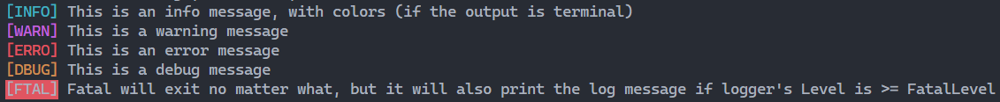

# ✒️ golog

_golog_ is a zero-dependency simple, fast and easy-to-use level-based logger written in [Go Programming Language](https://go.dev).



[](https://github.com/kataras/golog/actions) [](http://goreportcard.com/report/kataras/golog) [](https://pkg.go.dev/github.com/kataras/golog) [](https://github.com/kataras/golog/issues?q=is%3Aopen+is%3Aissue)

<!-- ## 🥇 Features

* Focus on high performance and agile perspective of things
* Easy API and a default package-level instance, i.e `golog#Fatalf/Errorf/Warnf/Infof/Debugf`
* Fully compatible with the standard library
* Thanks to the [pio library](https://github.com/kataras/pio) it supports any type of structure, gives you the ability to `Hijack` and `Handle` or `Intercept` the on-going logs too 
* Set or even Add unlimited number of output targets, `io.Writer`
* Scan from any `io.Reader` and log to the defined output target(s)
* Levels such as `fatal`,`error`, `warn`, `info`, `debug`, or `disable`
* Beautiful (**customizable**) colors for leveled logs, automatically omit colors when output does not support colors (i.e files)
* Incredible high-performant, 3 times faster than your favourite logger
* Never-Panics

Navigate through [_examples](_examples/) and [integrations](_examples/integrations/) to learn if that fair solution suits your needs. -->

## 🚀 Installation

The only requirement is the Go Programming Language[*](https://go.dev/dl).

<details>
<summary>Go modules</summary>

```bash
$ go get github.com/kataras/golog@latest
```

Or edit your project's go.mod file and execute $ go build.

```mod
module your_project_name

go 1.19

require (
    github.com/kataras/golog v0.1.8
)
```

> `$ go build`

</details>

```bash
$ go get github.com/kataras/golog@latest
```

```go
package main

import (
    "github.com/kataras/golog"
)

func main() {
    // Default Output is `os.Stdout`,
    // but you can change it:
    // golog.SetOutput(os.Stderr)

    // Time Format defaults to: "2006/01/02 15:04"
    // you can change it to something else or disable it with:
    // golog.SetTimeFormat("")

    // Level defaults to "info",
    // but you can change it:
    golog.SetLevel("debug")

    golog.Println("This is a raw message, no levels, no colors.")
    golog.Info("This is an info message, with colors (if the output is terminal)")
    golog.Warn("This is a warning message")
    golog.Error("This is an error message")
    golog.Debug("This is a debug message")
    golog.Fatal(`Fatal will exit no matter what,
    but it will also print the log message if logger's Level is >=FatalLevel`)
}
```

## Log Levels

| Name      | Method                  | Text     | Color              |
| ----------|-------------------------|----------|--------------------|
| `"fatal"` | `Fatal, Fatalf`         | `[FTAL]` | Red background     |
| `"error"` | `Error, Errorf`         | `[ERRO]` | Red foreground     |
| `"warn"`  | `Warn, Warnf, Warningf` | `[WARN]` | Magenta foreground |
| `"info"`  | `Info, Infof`           | `[INFO]` | Cyan foreground    |
| `"debug"` | `Debug, Debugf`         | `[DBUG]` | Yellow foreground  |

> On debug level the logger will store stacktrace information to the log instance, which is not printed but can be accessed through a `Handler` (see below).

### Helpers

```go
// GetTextForLevel returns the level's (rich) text. 
fatalRichText := golog.GetTextForLevel(golog.FatalLevel, true)

// fatalRichText == "\x1b[41m[FTAL]\x1b[0m"
```

```go
// ParseLevel returns a Level based on its string name.
level := golog.ParseLevel("debug")

// level == golog.DebugLevel
```

### Customization

You can customize the log level attributes.

```go
func init() {
    // Levels contains a map of the log levels and their attributes.
    errorAttrs := golog.Levels[golog.ErrorLevel]

    // Change a log level's text.
    customColorCode := 156
    errorAttrs.SetText("custom text", customColorCode)

    // Get (rich) text per log level.
    enableColors := true
    errorRichText := errorAttrs.Text(enableColors)
}
```

Alternatively, to change a specific text on a known log level, you can just call:

```go
golog.ErrorText("custom text", 156)
```

## Integration

The `golog.Logger` is using common, expected log methods, therefore you can integrate it with ease.

Take for example the [badger](github.com/dgraph-io/badger) database. You want to add a prefix of `[badger]` in your logs  when badger wants to print something.

1. Create a child logger with a prefix text using the `Child` function,
2. disable new lines (because they are managed by badger itself) and you are ready to GO:

```go
opts := badger.DefaultOptions("./data")
opts.Logger = golog.Child("[badger]").DisableNewLine()

db, err := badger.Open(opts)
// [...]
```

### Level-based and standard Loggers

You can put `golog` in front of your existing loggers using the [Install](https://pkg.go.dev/github.com/kataras/golog?tab=doc#Logger.Install) and [InstallStd](https://pkg.go.dev/github.com/kataras/golog?tab=doc#InstallStd) methods.

Any level-based Logger that implements the [ExternalLogger](https://pkg.go.dev/github.com/kataras/golog?tab=doc#ExternalLogger) can be adapted.

E.g. [sirupsen/logrus](https://github.com/sirupsen/logrus):

```go
// Simulate a logrus logger preparation.
logrus.SetLevel(logrus.InfoLevel)
logrus.SetFormatter(&logrus.JSONFormatter{})

golog.Install(logrus.StandardLogger())

golog.Debug(`this debug message will not be shown,
    because the logrus level is InfoLevel`)
golog.Error(`this error message will be visible as JSON,
    because of logrus.JSONFormatter`)
```

Any standard logger (without level capabilities) that implements the [StdLogger](https://pkg.go.dev/github.com/kataras/golog?tab=doc#StdLogger) can be adapted using the [InstallStd](https://pkg.go.dev/github.com/kataras/golog?tab=doc#InstallStd) method.

E.g. `log` standard package:

```go
// Simulate a log.Logger preparation.
myLogger := log.New(os.Stdout, "", 0)

golog.SetLevel("error")
golog.InstallStd(myLogger)

golog.Error("error message")
```

## Output Format

Any value that completes the [Formatter interface](https://github.com/kataras/golog/blob/master/formatter.go) can be used to write to the (leveled) output writer. By default the `"json"` formatter is available.

### JSON

```go
import "github.com/kataras/golog"

func main() {
    golog.SetLevel("debug")
    golog.SetFormat("json", "    ") // < --

    // main.go#29
    golog.Debugf("This is a %s with data (debug prints the stacktrace too)", "message", golog.Fields{
        "username": "kataras",
    })
}
```

**Output**

```json
{
    "timestamp": 1591423477,
    "level": "debug",
    "message": "This is a message with data (debug prints the stacktrace too)",
    "fields": {
        "username": "kataras"
    },
    "stacktrace": [
        {
            "function": "main.main",
            "source": "C:/example/main.go:29"
        }
    ]
}
```

### Register custom Formatter

```go
golog.RegisterFormatter(new(myFormatter))
golog.SetFormat("myformat", options...)
```

The `Formatter` interface looks like this:

```go
// Formatter is responsible to print a log to the logger's writer.
type Formatter interface {
	// The name of the formatter.
	String() string
	// Set any options and return a clone,
	// generic. See `Logger.SetFormat`.
	Options(opts ...interface{}) Formatter
	// Writes the "log" to "dest" logger.
	Format(dest io.Writer, log *Log) bool
}
```

### Custom Format using `Handler`

The Logger can accept functions to handle (and print) each [Log](https://pkg.go.dev/github.com/kataras/golog?tab=doc#Log) through its [Handle](https://pkg.go.dev/github.com/kataras/golog?tab=doc#Logger.Handle) method. The Handle method accepts a [Handler](https://pkg.go.dev/github.com/kataras/golog?tab=doc#Handler).

```go
type Handler func(value *Log) (handled bool)
```

This method can be used to alter Log's fields based on custom logic or to change the output destination and its **output format**.

**Create a JSON handler**

```go
import "encoding/json"

func jsonOutput(l *golog.Log) bool {
    enc := json.NewEncoder(l.Logger.GetLevelOutput(l.Level.String()))
    enc.SetIndent("", "    ")
    err := enc.Encode(l)
    return err == nil
}
```

**Register the handler and log something**

```go
import "github.com/kataras/golog"

func main() {
    golog.SetLevel("debug")
    golog.Handle(jsonOutput)

    // main.go#29
    golog.Debugf("This is a %s with data (debug prints the stacktrace too)", "message", golog.Fields{
        "username": "kataras",
    })
}
```

## Examples

* [basic](_examples/basic/main.go)
* [output per level](_examples/level-output/main.go)
* [child](_examples/child/main.go)
* [add new level](_examples/customize-levels/new-level/main.go)
* [change text and color](_examples/customize-levels/text-and-colors/main.go)
* [customize output](_examples/customize-output/main.go)
* [multi output](_examples/multi-output/main.go)
* [scan](_examples/scan/main.go)
* [logurs integration](_examples/integrations/logrus/main.go)
* [log.Logger std integration](_examples/integrations/std/main.go)
* [new instance](_examples/instance/main.go)

## 🔥 Benchmarks

| test | times ran (large is better) |  ns/op (small is better) | B/op (small is better) | allocs/op (small is better) |
| -----------|--------|-------------|-------------|-------------|
| **BenchmarkGologPrint** | 10000000 | 3749 ns/op | 890 B/op | 28 allocs/op |
| BenchmarkLogrusPrint | &nbsp; 3000000 | 9609 ns/op | 1611 B/op | 64 allocs/op |

Click [here](_benchmarks) for details.

## 👥 Contributing

If you find that something is not working as expected please open an [issue](https://github.com/kataras/golog/issues).
