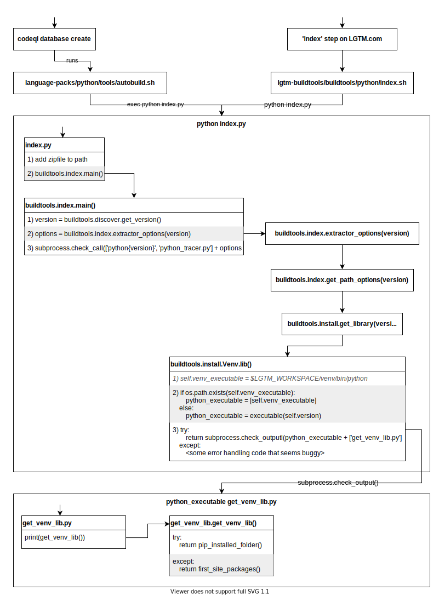

# Python extraction

Python extraction happens in two phases:

1. [Setup](#1-Setup-Phase)
   - determine which version to analyze the project as
   - creating virtual environment (only LGTM.com)
   - determine python import path
   - invoking the actual python extractor
2. [The actual Python extractor](#2-The-actual-Python-extractor)
   - walks files and folders, and performs extraction

The rule for `pack_zip('python-extractor')` in `build` defines what files are included in a distribution and in the CodeQL CLI. After building the CodeQL CLI locally, the files are in `target/intree/codeql/python/tools`.

## Local development

This project uses

- [poetry](https://python-poetry.org/) as the package manager
- [tox](https://tox.wiki/en) together with [pytest](https://docs.pytest.org/en/) to run tests across multiple versions

You can install both tools with [`pipx`](https://pypa.github.io/pipx/), like so

```sh
pipx install poetry
pipx inject poetry virtualenv-pyenv # to allow poetry to find python versions from pyenv
pipx install tox
pipx inject tox virtualenv-pyenv # to allow tox to find python versions from pyenv
```

Once you've installed poetry, you can do this:

```sh
# install required packages
$ poetry install

# to run tests against python version used by poetry
$ poetry run pytest

# or
$ poetry shell # activate poetry environment
$ pytest # so now pytest is available

# to run tests against all support python versions
$ tox

# to run against specific version (Python 3.9)
$ tox -e py39
```

To install multiple python versions locally, we recommend you use [`pyenv`](https://github.com/pyenv/pyenv)

_(don't try to use `tox run-parallel`, our tests are not set up for this to work 😅)_

### Zip files

Currently we distribute our code in an obfuscated way, by including the code in the subfolders in a zip file that is imported at run-time (by the python files in the top level of this directory).

The one exception is the `data` directory (used for stubs) which is included directly in the `tools` folder.

The zip creation is managed by [`make_zips.py`](./make_zips.py), and currently we make one zipfile for Python 2 (which is byte compiled), and one for Python 3 (which has source files, but they are stripped of comments and docstrings).

### A note about Python versions

We expect to be able to run our tools (setup phase) with either Python 2 or Python 3, and after determining which version to analyze the code as, we run the extractor with that version. So we must support:

- Setup tools run using Python 2:
  - Extracting code using Python 2
  - Extracting code using Python 3
- Setup tools run using Python 3:
  - Extracting code using Python 2
  - Extracting code using Python 3

# 1. Setup phase

**For extraction with the CodeQL CLI locally** (`codeql database create --language python`)

- Runs [`language-packs/python/tools/autobuild.sh`](/language-packs/python/tools/autobuild.sh) and this script runs [`index.py`](./index.py)

### Overview of control flow for [`setup.py`](./setup.py)

The representation of the code in the figure below has in some cases been altered slightly, but is accurate as of 2020-03-20.

<details open>

<!-- This file can be opened with diagrams.net directly -->


</details>

### Overview of control flow for [`index.py`](./index.py)

The representation of the code in the figure below has in some cases been altered slightly, but is accurate as of 2020-03-20.

<details open>

<!-- This file can be opened with diagrams.net directly -->



</details>

# 2. The actual Python extractor

## Overview

The entrypoint of the actual Python extractor is [`python_tracer.py`](./python_tracer.py).

The usual way to invoke the extractor is to pass a directory of Python files to the launcher. The extractor extracts code from those files and their dependencies, producing TRAP files, and copies the source code to a source archive.
Alternatively, for highly distributed systems, it is possible to pass a single file to the per extractor invocation; invoking it many times.
The extractor recognizes Python source code files and Thrift IDL files.
Other types of file can be added to the database, by passing the `--filter` option to the extractor, but they'll be stored as text blobs.

The extractor expects the `CODEQL_EXTRACTOR_PYTHON_TRAP_DIR` and
`CODEQL_EXTRACTOR_PYTHON_SOURCE_ARCHIVE_DIR` environment variables to be set (which determine,
respectively, where it puts TRAP files and the source archive). However, the location of the TRAP
folder and source archive can be specified on the command-line instead.

The extractor outputs the following information as TRAP files:

- A file containing per-interpreter data, such as version information and the contents of the `builtins` module.
- One file per extractor process containing the file and folder information for all processed files and all enclosing folders.
- Per Python or template file:
  - The AST.
  - Scopes and variables, attached to the AST.
  - The control-flow graph, selectively split when repeated tests are seen.

## How it works

### Overall Architecture

Once started, the extractor consists of three sets of communicating processes.

1.  The front-end: A single process which walks the files and folders specified on the command-line, enqueuing those files plus any additional modules requested by the extractor processes.
2.  The extractors: Typically one process per CPU. Takes file and module descriptions from the queue, producing TRAP files and copies of the source.
3.  The logging process. To avoid message interleaving and avoid deadlock, all log messages are queued up to be sent to a logging process which formats and prints the messages.

The front-end -> worker message queue has quite limited capacity (2 per process) to ensure rapid shutdown when interrupted. The capacity of the worker -> front-end message queue must be at least twice that size to prevent deadlock, and is in fact much larger to prevent workers being blocked on the queue.

Experiments suggest that the extractor scales almost linearly to at least 20 processes (on linux).

The component that walks the file system is known as the "traverser" and is designed to be pluggable.
Its interface is simply an iterable of file descriptions. See `semmle/traverser.py`.

### Lifetime of the extractor

1. Parse the command-line options and read environment variables.
2. The main process creates:
   1. the logging queue and process,
   2. the message queues, and
   3. the extractor processes.
3. The main process, now the front-end, starts traversing the file system, by iterating over the traverser.
4. Until it has exhausted the traverser, it concurrently:
   - Adds module descriptions from the traverser to the message queue
   - Reads the reply queue and for any `"IMPORT"` message received adds the module to the message queue if that module has not been seen before.
5. Until a `"SUCCESS"` message has been received on the reply queue for each module description that has been enqueued:
   - Reads the reply queue and adds those module descriptions it hasn't seen before to the message queue.
6. Add one `None` message to the message queue for each extractor.
7. Wait for all extractors to halt.
8. Stop the logging process and halt.

### Lifetime of an extractor process

1. Read messages from the message queue until a `None` message is received. For each message:
   1. Parse the file or module.
   2. Send an "IMPORT" message for all modules imported by the module being processed.
   3. Write out TRAP and source archive for the file.
   4. Send a "SUCCESS" message for the file.
2. Emit file and folder TRAP for all files and modules processed.
3. Halt.

### TRAP caching

An important consequence of local extraction is that, except for the file path information, the contents of the TRAP file are functionally determined by:

- The contents of the file.
- Some command-line options (those determining name hashing and CFG splitting).
- The extractor version.

Caching of TRAP files can reduce the time to extract a large project with few changes by an order of magnitude.

### Extraction

Each extractor process runs a loop which extracts files or modules from the queue, one at a time.
Each file or module description is passed, in turn, to one of the extractor objects which will either extract it or reject it for the next extractor object to try.
Currently the default extractors are:

- Builtin module extractor: Extracts built-in modules like `sys`.
- Thrift extractor: Extracts Thrift IDL files.
- Python extractor: Extracts Python source code files.
- Package extractor: Extracts minimal information for package folders.
- General file extractor: Any files rejected by the above passes are added to the database as a text blob.

#### Python extraction

The Python extractor is the most interesting of the processes mentioned above.
The Python extractor takes a path to a Python file. It emits TRAP to the specified folder and a UTF-8 encoded version of the source to the source archive.
It consists of the following passes:

1. Ingestion and decoding: Read the contents of the file as bytes, determine its encoding, and decode it to text.
2. Tokenizing: Tokenize the source text, including whitespace and comment tokens.
3. Parsing: Create a concrete parse tree from the list of tokens.
4. Rewriting: Rewrite the concrete parse tree to an AST, annotated with scope, variable information, and locations.
5. Write out lexical and AST information as TRAP.
6. Generate and emit TRAP for control-flow graphs. This is done one scope at a time to minimize memory consumption.
7. Emit ancillary information, like TRAP for comments.

#### Template file extraction

Most Python template languages work by either translating the template into Python or by fairly closely mimicking the behavior of Python. This means that we can extract template files by converting them to the same AST used internally by the Python extractor and then passing that AST to the backend of the Python extractor to determine imports, and generate TRAP files including control-flow information.
